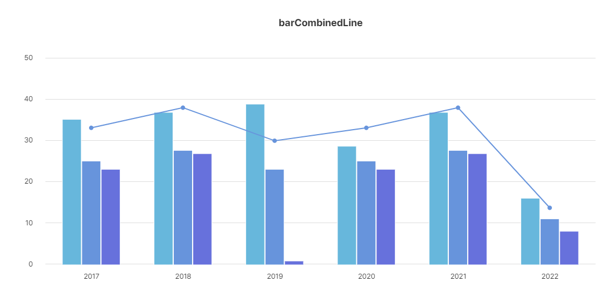
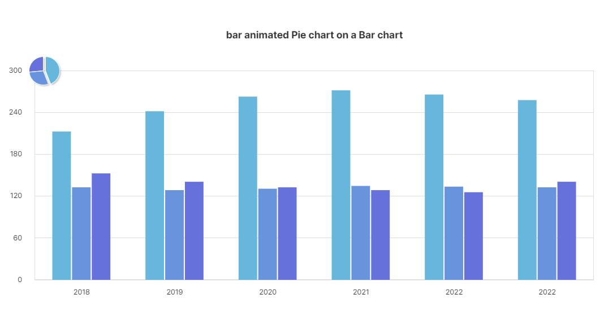

---
title: DXChart MultiChart
description:
--- 

> <link rel="stylesheet" type="text/css" href="../index.css">
<!-- > 
> **DXChart 개발자 튜토리얼**
>
> **(Nexacro용)** -->
<!-- --- -->

<!-- **\[목 차\]**
각각의 목차를 클릭시 해당 페이지로 이동합니다


[**4.** **Multi Chart 생성하기**](#multi-chart-생성하기)
 - [Bar 및 Line 차트](#bar-및-line-차트)
 - [Bar 및 Pie 차트](#bar-및-pie-차트) -->


# 4. Multi Chart 생성하기

<details style="padding-top: 30px;">
<summary>[목차]</summary>
<div markdown="1">
 - [Bar 및 Line 차트](#bar-및-line-차트)
 - [Bar 및 Pie 차트](#bar-및-pie-차트)
</div>
</details>

### Bar 및 Line 차트

 

```javascript
var bar = new DxChartBar({
    id: cvs,
    elem: canvas,
    binddataset: this.Dataset00_00,
    data: ["bind:seoul", "bind:busan", "bind:daegu"],
    options: {
        margin: { Left: 105, Right: 55, Top: 135, Inner: 30, Bottom: 82 },
        xaxis: {
            Use: false,
            Labels: ['bind:year'],
            ScaleZerostart: true,
            Color: "#E2E2E2",
            LabelsOffsetY: 5,
            Tickmarks: false
        },
        colorsStroke: 'white',
        linewidth: 2,
        shadow: { Offsetx: 1, Offsety: 0, Blur: 1 },
        background: { GridVlines: false, GridBorder: false },
        yaxis: {
            Use: false,
            Color: "#E2E2E2",
            LabelsOffsetX: -15,
            Tickmarks: false,
            ScaleMax: 50
        },
        title: { Text: 'barCombinedLine', Y: 73 },
        combinedEffect: 'wave',
        combinedEffectOptions: '{frames: 90}',
        tooltips: {
            Data: '%{value_formatted}',
            Effect: 'fade',
            Pointer: false,
            FormattedUnitsPost: '%'
        }
    }
});

var line = new DxChartLine({
    id: cvs,
    elem: canvas,
    binddataset: this.Dataset00_00,
    data: ['bind:total'],
    options: {
        colors: ["#6794DC"],
        spline: true,
        tickmarksStyle: 'filledcircle',
        yaxisScaleMax: 40,
        shadow: false,
        xaxis: false,
        yaxis: false,
        combinedEffect: 'trace',
        combinedEffectOptions: '{frames: 90}',
        tooltips: {
            Data: '%{value}',
            Effect: 'fade',
            Pointer: true
        }
    }
});

var combo = new DxChart.CombinedChart(bar, line);
combo.draw();
```

> 1. 각각 bar와 Line의 object를 생성합니다.
> 2. DxChart.CombinedChart를 통해 margin 값 계산 후 함께 그려집니다.

### Bar 및 Pie 차트

 

```javascript
var bar = new DxChartBar({
    id: cvs,
    elem: canvas,
    binddataset: this.Dataset00,
    data: ["bind:child", "bind:middle", "bind:high"],
    options: {
        margin: { Left: 105, Right: 55, Top: 135, Inner: 30, Bottom: 82 },
        title: { Text: 'bar animated Pie chart on a Bar chart', Y: 73 },
        xaxis: {
            Labels: ['bind:year'],
            ScaleMax: 200,
            Color: "#E2E2E2",
            LabelsOffsetY: 5,
            Tickmarks: false
        },
        yaxis: {
            Use: false,
            Color: "#E2E2E2",
            LabelsOffsetX: -15,
            Tickmarks: false
        },
        colorsStroke: 'rgba(0,0,0,0)',
        background: { GridVlines: false }
    }
}).draw();

var pie = new DxChartPie({
    id: cvs,
    elem: canvas,
    binddataset: this.Dataset00,
    data: ["bind:pieValue"],
    options: {
        center: { x: 120, y: bar.get('marginTop') },
        radius: 25,
        exploded: [5],
        colorsStroke: 'rgba(0,0,0,0)',
        colorsStroke: '#fff',
        shadow: false,
        linewidth: 1
    }
}).roundRobin({ frames: 60 });
```

> 1. 각각 bar와 pie의 object를 생성합니다.
> 2. DxChart.CombinedChart를 사용하지 않고 margin 값으로 설정하여 함께
> 생성하였습니다.


