<link rel="stylesheet" type="text/css" href="{{ site.baseurl }}/assets/index.css">


<!-- 
> **DXChart 개발자 튜토리얼**
>
> **(Nexacro용)**
--- -->

<!-- **\[목 차\]**
각각의 목차를 클릭시 해당 페이지로 이동합니다


 [**2.** **DxChart 속성**](#DxChart-속성)
   - [Margin (옵션 - margin 그룹)](#margin-옵션---margin-그룹)
   - [Margin Property 예제](#margin-사용-예제)
   - [Text Property 예제](#text-property-예제)
   - [제목 (옵션 - title 그룹)](#제목-옵션-title-그룹)
   - [X축 (옵션 - xaxis 그룹)](#x축-옵션-xaxis-그룹)
   - [Y축 (옵션 - yaxis 그룹)](#y축-옵션-yaxis-그룹)
   - [Background 설정하기](#background-설정하기)
   - [Label 설정하기](#label-설정하기)
   - [범례](#범례-설정하기)
   - [툴팁](#툴팁-설정하기)
  
<br><br> -->

# 2. DxChart 속성

<details style="padding-top: 30px;">
<summary>[목차]</summary>
<div markdown="1">
   - [2.1 Margin (옵션 - margin 그룹)](#21-margin-옵션---margin-그룹)
   - [2.2 Text 옵션](#22-text-옵션)
   - [2.3 제목 (옵션 - title 그룹)](#23-제목-옵션-title-그룹)
   - [2.4 X축 (옵션 - xaxis 그룹)](#24-x축-옵션-xaxis-그룹)
   - [2.5 Y축 (옵션 - yaxis 그룹)](#25-y축-옵션----yaxis-그룹)
   - [2.6 Background 설정하기](#26-background-설정하기)
   - [2.7 Label 설정하기](#27-label-설정하기)
   - [2.8 범례 설정하기](#28-범례-설정하기)
   - [2.9 툴팁 설정하기](#29-툴팁-설정하기)
</div>
</details>


## 차트 주요 Properties
---

### 2.1 Margin (옵션 - margin 그룹)

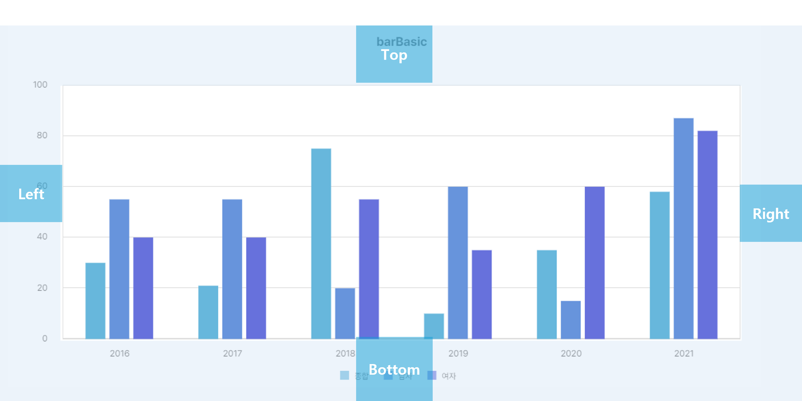

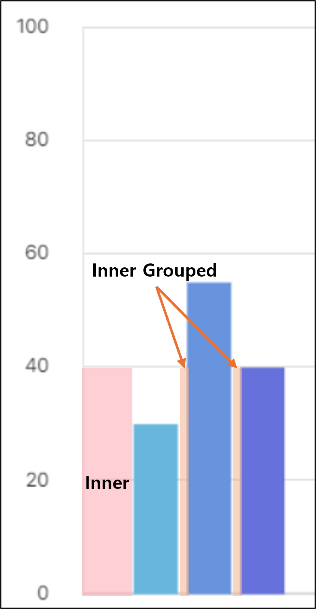{: width="250" height="300"}

  <table>
    <tr>
      <th style="text-align: center;">Sub property</th>
      <th style="text-align: center;">설명</th>
      <th style="text-align: center;">타입</th>
      <th style="text-align: center;">기본값</th>
    </tr>
    <tr>
      <td style="text-align: center;">Bottom</td>
      <td style="text-align: center;">차트의 아래쪽 여백을 설정합니다.</td>
      <td style="text-align: center;">number</td>
      <td style="text-align: center;">35</td>
    </tr>
    <tr>
      <td style="text-align: center;">Inner</td>
      <td style="text-align: center;">차트의 내부 여백을 설정합니다.</td>
      <td style="text-align: center;">number</td>
      <td style="text-align: center;">5</td>
    </tr>
    <tr>
      <td style="text-align: center;">InnerGrouped</td>
      <td style="text-align: center;">그룹화된 차트에서 동일한 그룹에 있는 요소 사이의 여백입니다.</td>
      <td style="text-align: center;">number</td>
      <td style="text-align: center;">1</td>
    </tr>
    <tr>
      <td style="text-align: center;">Left</td>
      <td style="text-align: center;">차트의 왼쪽 여백을 설정합니다.</td>
      <td style="text-align: center;">number</td>
      <td style="text-align: center;">35</td>
    </tr>
    <tr>
      <td style="text-align: center;">Right</td>
      <td style="text-align: center;">차트의 오른쪽 여백을 설정합니다.</td>
      <td style="text-align: center;">number</td>
      <td style="text-align: center;">35</td>
    </tr>
    <tr>
      <td style="text-align: center;">Top</td>
      <td style="text-align: center;">차트의 위쪽 여백을 설정합니다.</td>
      <td style="text-align: center;">number</td>
      <td style="text-align: center;">35</td>
    </tr>
  </table>


#### Margin 사용 예제

아래는 차트의 Margin Properties 설정하기 튜토리얼 입니다.


```javascript
      var bar = new DxChartBar({
        id: cvs,
        elem : canvas,
        binddataset : this.Dataset00,
        data:["bind:total","bind:man","bind:woman"],
        options: {
            margin: { 
            Left: 100,    // 차트의 왼쪽 여백 값을 설정할수 있습니다.
            Right: 100,  // 차트의 오른쪽 여백 값을 설정할수 있습니다.
            Top: 50,     // 차트의 위쪽 여백 값을 설정할수 있습니다.
            Bottom: 50,  // 차트의 아래쪽 여백 값을 설정할수 있습니다.
            Inner : 20,  // 차트의 내부의 여백 값을 설정할수 있습니다.
            InnerGroupued : 20  // 차트의 그룹 사이 여백 값을 설정할수 있습니다.
      },
        }.
      }).draw();


```


### 2.2 Text 옵션
---
<!-- #### Text Property 예제 -->
차트 내부에 렌더링 되는 모든 Text 값들의 색상, Font Style을 지정할 수
있습니다. title, X축라벨, Y축라벨 등 모든 텍스트 값들을 제어할 수
있습니다.

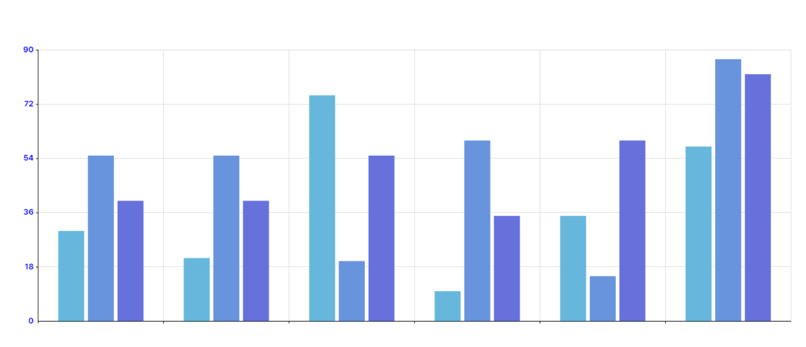

```javascript

var bar = new DxChartBar({

id: cvs,
elem : canvas,
binddataset : this.Dataset00,
data:["bind:total","bind:man","bind:woman"],
options: {
    text: {
    Color:'Blue', // text 색상을 설정할수 있습니다. 위의 예제에선 Y축 라벨색상입니다.
    FontStyle: '20px bold Pretendard' // Text FontStyle을 설정할 수 있습니다.
    }
}
}).draw();
```


### 2.3 제목 (옵션 title 그룹)


<table>
    <tr>
        <th>Sub property</th>
        <th>설명</th>
        <th>타입</th>
        <th>기본값</th>
    </tr>
    <tr>
        <td>Color</td>
        <td>제목의 색을 지정합니다.</td>
        <td>object</td>
        <td>null</td>
    </tr>
    <tr>
        <td>FontStyle</td>
        <td>제목의 글꼴 스타일을 지정합니다.</td>
        <td>string</td>
        <td>null</td>
    </tr>
    <tr>
        <td>Halign</td>
        <td>제목의 가로 정렬을 지정합니다. left, right, center를 사용할 수 있습니다.</td>
        <td>object</td>
        <td>null</td>
    </tr>
    <tr>
        <td>OffsetX</td>
        <td>제목의 가로 오프셋을 지정합니다.</td>
        <td>number</td>
        <td>0</td>
    </tr>
    <tr>
        <td>OffsetY</td>
        <td>제목의 세로 오프셋을 지정합니다.</td>
        <td>number</td>
        <td>0</td>
    </tr>
    <tr>
        <td>Subtitle</td>
        <td>차트의 부제목을 지정합니다. 제목 바로 아래에 생기기 때문에 마진을 주지 않으면 제목이 제대로 보이지 않을 수 있습니다.</td>
        <td>string</td>
        <td></td>
    </tr>
    <tr>
        <td>SubtitleColor</td>
        <td>부제목의 색을 지정합니다.</td>
        <td>string</td>
        <td>#aaa</td>
    </tr>
    <tr>
        <td>SubtitleFontStyle</td>
        <td>부제목의 글꼴 스타일을 지정합니다.</td>
        <td>string</td>
        <td>null</td>
    </tr>
    <tr>
        <td>SubtitleOffsetX</td>
        <td>부제목의 가로 오프셋을 지정합니다.</td>
        <td>number</td>
        <td>0</td>
    </tr>
    <tr>
        <td>SubtitleOffsetY</td>
        <td>부제목의 세로 오프셋을 지정합니다.</td>
        <td>number</td>
        <td>0</td>
    </tr>
    <tr>
        <td>Text</td>
        <td>중앙 상단의 제목을 지정합니다.</td>
        <td>string</td>
        <td></td>
    </tr>
    <tr>
        <td>Valign</td>
        <td>제목의 세로 정렬을 지정합니다. top, bottom, center를 사용할 수 있습니다.</td>
        <td>object</td>
        <td>null</td>
    </tr>
    <tr>
        <td>X</td>
        <td>제목의 가로 좌표를 지정합니다.</td>
        <td>object</td>
        <td>null</td>
    </tr>
    <tr>
        <td>Y</td>
        <td>제목의 세로 좌표를 지정합니다.</td>
        <td>object</td>
        <td>null</td>
    </tr>
</table>


#### Title Property 예제
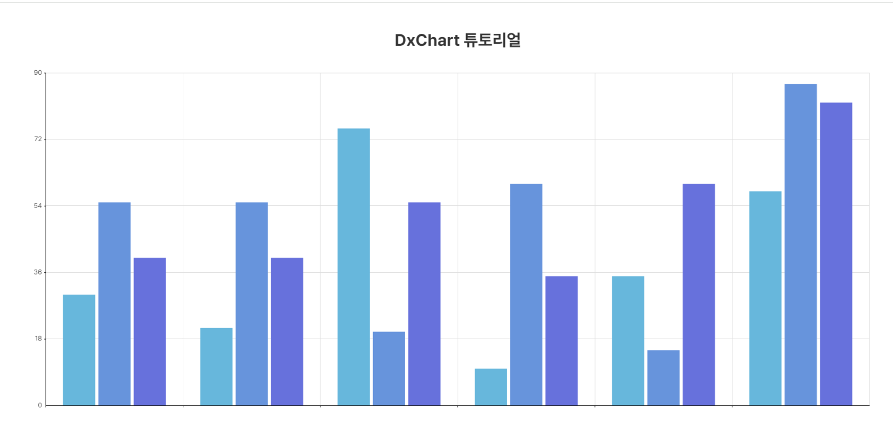

```javascript
    var bar = new DxChartBar({
    id: cvs,
    elem : canvas,
    binddataset : this.Dataset00,
    data:["bind:total","bind:man","bind:woman"],
    options: {
    title: { 
      Text : 'DxChart 튜토리얼', // 차트의 title Text값을설정합니다.
      FontStyle: '32px bold Pretendard', // title FontStyle을 설정할 수 있습니다.
      Y :73, // 차트 내 title의 Y 위치값을 설정 할수 있습니다.
      X: 450 // 차트 내 title의 X 위치값을 설정 할수 있습니다.
      },
    }
    }).draw();
```


#### 제목(옵션 -Subtitle)

DxChart는 Main Title 외에 차트의 부제목 또한 설정할 수 있습니다. 같은
title Properties내에 Subtitle

옵션값으로 설정 할 수 있습니다.

<table text-align="center"  cellpadding="5" cellspacing="0">
  <tr>
    <th>Sub property</th>
    <th>설명</th>
    <th>타입</th>
    <th>기본값</th>
  </tr>
  <tr>
    <td>Subtitle</td>
    <td>차트의 부제목을 지정합니다.<br>제목 바로 아래에 생기기 때문에 마진을 주지 않으면 제목이 제대로 보이지 않을 수 있습니다.</td>
    <td>string</td>
    <td></td>
  </tr>
  <tr>
    <td>SubtitleColor</td>
    <td>부제목의 색을 지정합니다.</td>
    <td>string</td>
    <td>#aaa</td>
  </tr>
  <tr>
    <td>SubtitleFontStyle</td>
    <td>부제목의 글꼴 스타일을 지정합니다.</td>
    <td>string</td>
    <td>null</td>
  </tr>
  <tr>
    <td>SubtitleOffsetX</td>
    <td>부제목의 가로 오프셋을 지정합니다.</td>
    <td>number</td>
    <td>0</td>
  </tr>
  <tr>
    <td>SubtitleOffsetY</td>
    <td>부제목의 세로 오프셋을 지정합니다.</td>
    <td>number</td>
    <td>0</td>
  </tr>
</table>

##### SubTitle Property 예제 

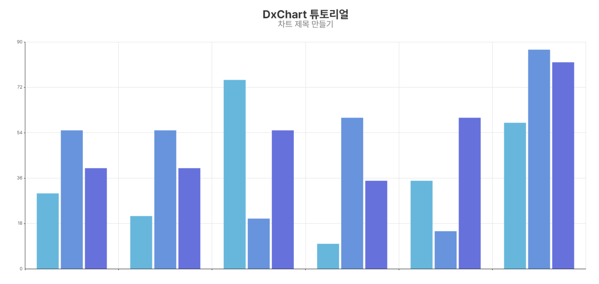

```javascript
var bar = new DxChartBar({
id: cvs,
elem : canvas,
binddataset : this.Dataset00,
data:["bind:total","bind:man","bind:woman"],
options: {
      title: {
         Text : 'DxChart 튜토리얼', // 차트의 title Text값을설정합니다.
        Subtitle: '차트 제목 만들기', // 차트의 부제목을 설정할 수있습니다.
         SubtitleFontStyle : '24px Pretendard' // 차트 부제목의 폰트스타일을 설정 할 수 있습니다.
        // SubtitleOffsetY: 103 // 차트 부제목의 Offset Y 좌표 위치를 설정 할 수있습니다. X 좌표 위치값 변경도 가능합니다.
      },
}
}).draw();
```

### 2.4 X축 (옵션 xaxis 그룹)
---
차트의 X축에 대한 설정을 하는 Property입니다.


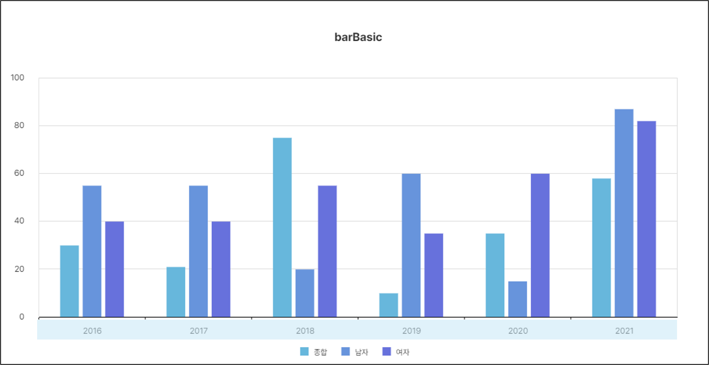


<table text-align="center"  border="1" cellpadding="5" cellspacing="0">
  <tr>
    <th>Sub property</th>
    <th>설명</th>
    <th>타입</th>
    <th>기본값</th>
  </tr>
  <tr>
    <td>AddLineSize</td>
    <td>x축 선의 길이를 지정합니다.<br>양수이면 원점에서 왼쪽으로 x축 길이가 늘어나며 음수이면 원점에서 오른쪽으로 x축 길이가 줄어듭니다.</td>
    <td>number</td>
    <td>0</td>
  </tr>
  <tr>
    <td>Color</td>
    <td>x축 선의 색을 지정합니다.</td>
    <td>string</td>
    <td>black</td>
  </tr>
  <tr>
    <td>Labels</td>
    <td>x축에서 사용할 라벨을 지정합니다.<br>라벨은 html 태그 형식 또는 배열 형태로 사용할 수 있습니다.</td>
    <td>object</td>
    <td>null</td>
  </tr>
  <tr>
    <td>LabelsAngle</td>
    <td>x축 라벨의 각도를 지정합니다.<br>양수일 때 지정한 각도만큼 왼쪽으로 회전하며 음수일 때 오른쪽으로 회전합니다.</td>
    <td>number</td>
    <td>0</td>
  </tr>
  <tr>
    <td>LabelsColor</td>
    <td>x축 라벨의 색을 지정합니다.</td>
    <td>object</td>
    <td>null</td>
  </tr>
  <tr>
    <td>LabelsFontStyle</td>
    <td>x축 라벨의 글꼴 스타일을 지정합니다.</td>
    <td>string</td>
    <td>null</td>
  </tr>
  <tr>
    <td>LabelsFormattedDecimals</td>
    <td>x축에서 %{value_formatted}처럼 형식이 지정된 라벨에서 지정한 값만큼의 소수점을 표시합니다.</td>
    <td>number</td>
    <td>0</td>
  </tr>
  <tr>
    <td>LabelsFormattedPoint</td>
    <td>x축에서 %{value_formatted}처럼 형식이 지정된 라벨에서 소수점 표시 방식을 지정합니다.</td>
    <td>string</td>
    <td>.</td>
  </tr>
  <tr>
    <td>LabelsFormattedThousand</td>
    <td>x축에서 %{value_formatted}처럼 형식이 지정된 라벨에서 천 단위 구분 기호를 지정합니다.</td>
    <td>string</td>
    <td>,</td>
  </tr>
  <tr>
    <td>LabelsFormattedUnitsPost</td>
    <td>x축에서 %{value_formatted}처럼 형식이 지정된 라벨에서 뒤에 표시할 문자를 지정합니다.</td>
    <td>string</td>
    <td></td>
  </tr>
  <tr>
    <td>LabelsFormattedUnitsPre</td>
    <td>x축에서 %{value_formatted}처럼 형식이 지정된 라벨에서 앞에 표시할 문자를 지정합니다.</td>
    <td>string</td>
    <td></td>
  </tr>
  <tr>
    <td>LabelsHalign</td>
    <td>x축 라벨의 가로 정렬을 지정합니다. left, right, center를 사용할 수 있습니다.</td>
    <td>object</td>
    <td>null</td>
  </tr>
  <tr>
    <td>LabelsOffsetX</td>
    <td>x축 라벨의 가로 오프셋을 지정합니다.</td>
    <td>number</td>
    <td>0</td>
  </tr>
  <tr>
    <td>LabelsOffsetY</td>
    <td>x축 라벨의 세로 오프셋을 지정합니다.</td>
    <td>number</td>
    <td>0</td>
  </tr>
  <tr>
    <td>LabelsPosition</td>
    <td>x축 라벨의 포지션을 지정합니다. section, edge를 사용할 수 있습니다. section은 영역쪽에 라벨이 위치하고 edge는 데이터 포인트 점에 라벨이 위치합니다.</td>
    <td>string</td>
    <td>section</td>
  </tr>
  <tr>
    <td>LabelsValign</td>
    <td>라벨의 세로 정렬을 지정합니다. top, bottom, center를 사용할 수 있습니다.</td>
    <td>object</td>
    <td>null</td>
  </tr>
  <tr>
    <td>Linewidth</td>
    <td>x축의 두께를 지정합니다.</td>
    <td>number</td>
    <td>1</td>
  </tr>
  <tr>
    <td>Position</td>
    <td>x축의 위치를 지정합니다. top, bottom, center를 사용할 수 있습니다.</td>
    <td>string</td>
    <td>bottom</td>
  </tr>
  <tr>
    <td>Tickmarks</td>
    <td>x축 라벨에 눈금을 표시할 지 여부입니다.</td>
    <td>boolean</td>
    <td>true</td>
  </tr>
  <tr>
    <td>TickmarksCount</td>
    <td>x축 라벨의 눈금 개수를 지정합니다.</td>
    <td>object</td>
    <td>null</td>
  </tr>
  <tr>
    <td>TickmarksLastLeft</td>
    <td>x축 라벨의 가장 왼쪽 마크를 표시할 지 여부입니다.</td>
    <td>object</td>
    <td>null</td>
  </tr>
  <tr>
    <td>TickmarksLastRight</td>
    <td>x축 라벨의 가장 오른쪽 마크를 표시할 지 여부입니다.</td>
    <td>object</td>
    <td>null</td>
  </tr>
  <tr>
    <td>TickmarksLength</td>
    <td>x축 라벨의 데이터마다 위치한 마크값의 길이를 지정합니다.</td>
    <td>number</td>
    <td></td>
  </tr>
  <tr>
    <td>Title</td>
    <td>x축의 제목을 지정합니다.</td>
    <td>string</td>
    <td></td>
  </tr>
  <tr>
    <td>TitleColor</td>
    <td>x축 제목의 색상을 지정합니다.</td>
    <td>object</td>
    <td>null</td>
  </tr>
  <tr>
    <td>TitleFontStyle</td>
    <td>x축 제목의 글꼴 스타일을 지정합니다.</td>
    <td>string</td>
    <td>null</td>
  </tr>
  <tr>
    <td>TitleHalign</td>
    <td>x축 제목의 가로 정렬을 지정합니다. 'left', 'right', 'center'를 사용할 수 있습니다.</td>
    <td>string</td>
    <td>center</td>
  </tr>
  <tr>
    <td>TitleOffsetX</td>
    <td>x축 제목의 가로 오프셋을 지정합니다.</td>
    <td>number</td>
    <td>0</td>
  </tr>
  <tr>
    <td>TitleOffsetY</td>
    <td>x축 제목의 세로 오프셋을 지정합니다.</td>
    <td>number</td>
    <td>0</td>
  </tr>
  <tr>
    <td>TitlePos</td>
    <td>x축 제목의 위치를 지정합니다. 양수일 때 아래로 내려가고 음수일 때 위로 올라갑니다.</td>
    <td>object</td>
    <td>null</td>
  </tr>
  <tr>
    <td>TitleValign</td>
    <td>x축 제목의 수직 정렬을 지정합니다. top, bottom, center를 사용할 수 있습니다.</td>
    <td>string</td>
    <td>top</td>
  </tr>
  <tr>
    <td>TitleX</td>
    <td>x축 제목의 가로 좌표를 지정합니다.</td>
    <td>object</td>
    <td>null</td>
  </tr>
  <tr>
    <td>TitleY</td>
    <td>x축 제목의 세로 좌표를 지정합니다.</td>
    <td>object</td>
    <td>null</td>
  </tr>
  <tr>
    <td>Use</td>
    <td>x축을 사용할 지 여부입니다.</td>
    <td>boolean</td>
    <td>true</td>
  </tr>
</table>

#### X축 Property 기본 예제

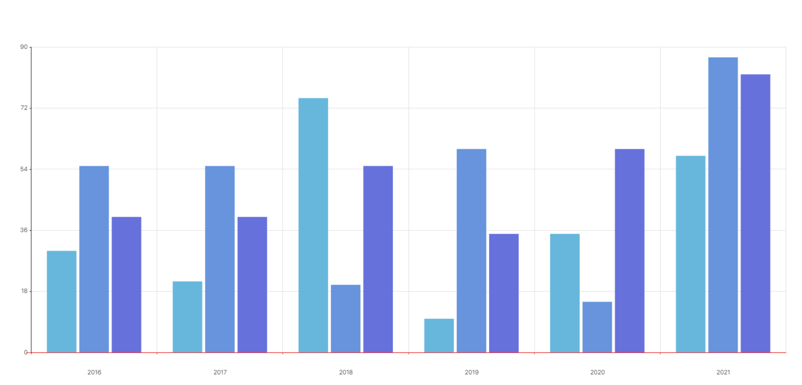


```javascript
var bar = new DxChartBar({

    id: cvs,
    elem : canvas,
    binddataset : this.Dataset00,
    data:["bind:total","bind:man","bind:woman"],
    options: {
        xaxis: {
          Use : false, // 차트의 X축을 Draw 할지 설정할 수 있습니다.
          Labels: ["bind:indecators"], // X축 라벨의 데이터 값을 설 정할 수있습니다. 주로 Nexacro 내 Dataset 바인딩을 통해 데이터 값을 설정 합니다. Nexacro가 아닌 다른 프레임워크나 실행환경에선 배열값으로 설정할수있습니다.
     //   ex) Lables :\['1','2','3','4','5'\]
          AddLineSize : 10, // X축 선의 길이 값을 설정 할 수 있습니다. }
          Color : 'red', // X축의 색상을 설정 할 수 있습니다.
          Position: 'bottom' // X축의 위치를 설정 할 수 있습니다. 기본값은bottom이며,top, bottom 두가지 값으로 설정 할 수 있습니다.X축의 Position을 top으로 설정 할 시 차트가 상하반전이 되어 렌더링됩니다.        
      }
    }
  }).draw();
  ```

#### X축 Labels 기본 예제
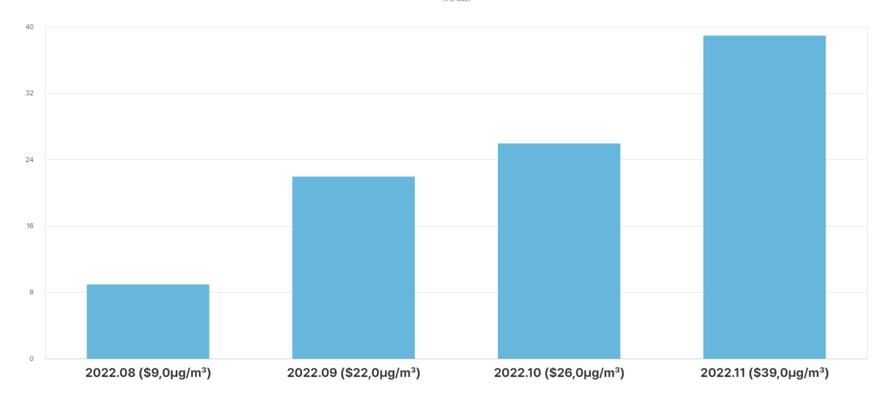


```javascript
var bar = new DxChartBar({
    id: cvs,
    elem: canvas,
    binddataset: this.Dataset00,
    data: ["bind:total", "bind:man", "bind:woman"],
    options: {
        // Labels formatted 사용을 위해 names 프로퍼티 선언 후, 데이터셋 바인딩을 해줍니다.
        // 프로퍼티 이름은 자유롭게 사용 가능합니다.
        names: DxChart.convertDataset(this.Dataset00, ['bind:year']),
        xaxis: {
            Use: true, // X축을 사용할 지 여부를 설정합니다.
          // Labels formatted 기능을 사용하기 위해 글로벌 내장 함수 사용을 합니다.
          // Labels formatted 기능을 제외할 시, 
          //기존과 동일하게 dataset 바인딩이나 배열 데이터로 선언합니다.
           
           // X축 Labels 형식을 설정합니다.
           Labels: '%{property:names[%{index}]} (%{value_formatted})', 
          // 차트의 X축 선의 두께 값을 설정합니다.
            LineWidth: 5,
          // 차트의 X축 Labels의 각도를 설정합니다. 양수, 음수 모두 가능합니다. 
            LabelsAngle: 5, 
          // 차트의 X축 Labels의 색상을 설정합니다.
            LabelsColor: 'blue',
          // X축 Labels의 가로 오프셋 값을 설정합니다.   
            LabelsOffsetX: 0,
          // X축 Labels의 세로 오프셋 값을 설정합니다.
            LabelsOffsetY: 15,
          // X축 Labels의 글꼴 스타일을 설정합니다.   
            LabelsFontStyle: '24px bold Pretendard',
          // X축 Labels에서 표시되는 소수점 수를 설정합니다. 
            LabelsFormattedDecimals: 1, 
          // X축 Labels에서 표시되는 소수점 문자를 설정합니다.  
            LabelsFormattedPoint: ".",
          // X축 Labels에서 표시되는 천 단위 구분점을 설정합니다.   
            LabelsFormattedThousand: ",",
          // X축 Labels 뒤에 오는 구분 문자를 설정합니다.   
            LabelsFormattedUnitsPost: " μg/m³", 
          // X축 Labels 앞에 오는 구분 문자를 설정합니다.  
            LabelsFormattedUnitsPre: "$", 
          // X축 Labels의 가로 정렬 방향을 설정합니다. (left, right, center)  
            LabelsHalign: 'center',
          // X축 Labels의 세로 오프셋 값을 설정합니다.   
            LabelsOffsetY: 0,
           // X축 Labels의 위치를 설정합니다. (section, edge)   
            LabelsPosition: 'section',
        }
    }
}).draw();

```

#### 추가 예제 xaxisLabelsFormatter

LabelsFormatter Properties는 차트의 데이터 값이나 라벨 데이터의 명확성을
제시할 수 있습니다. 기존 데이터에 추가적인 String값이나 특정 값을 붙여
줌으로써 해당 데이터의 명료성을 더해 줄 수 있습니다.

xaxisLabelsFormatter를 만들 때 사용할 수 있는 매크로는 다음과 같습니다.

#### 인덱스 매크로

> %{index}

-   이 매크로는 레이블의 인덱스를 표시합니다. 자바스크립트 배열과 같이
    0부터 시작하는 점을 유의해야 합니다.

#### 속성 매크로

> %{property:myProperties\[%{index}\]}

-   이 매크로는 템플릿 문자열에서 객체의 속성을 참조할 수 있게 해줍니다.
    예를 들어, 위의 이름 속성을 설정하고 템플릿 문자열에서 참조할 수
    있습니다. 속성 매크로 사용시, 해당 속성에 사용될 변수를 반드시
    할당하고 사용해야 합니다.

#### 값 매크로

> %{value}, %{value_formatted}

-   인덱스와 속성 매크로가 라벨에 명시될 값을 선언한다면, 값 매크로는
    명시될 값 뒤에 Formate value를 설정할수 있습니다. 따라서
    FormattedPost, FormattedPre 프로퍼티와 항상 함께 사용해야합니다.

> Ex) xaxis : {
>
> Labels: %{index} %{value_formatted} //인덱스매크로

- Labels: %{property:myProperties\[%{index}\]} %{value_formatted} // 속성
매크로

> //속성 매크로 사용시 항상 프로터피 오브젝트를 생성해주어야합니다.
>
> myProperties : \['1','2,'3','4,',,, \] ,
>
> myProperties : DxChart.convertDataset(this.Dataset, \['bind:data'\])
>
> }

#### 전역변수 매크로

> %{global:myVariable} %{global:myVariable\[%{index}\]}

-   이 매크로는 템플릿 문자열에서 전역 변수를 참조할 수 있게 합니다.
    이를 통해 차트 객체의 속성으로 데이터를 설정하는 것보다 쉽게
    데이터를 참조할 수 있습니다.

#### 함수 호출 매크로

> %{function:myFunction()} %{function:myFunction(%{index})}

-   이 매크로는 함수를 호출하여 반환 값을 레이블 텍스트로 사용할 수 있게
    합니다. 인수를 전달하지 않고 함수를 호출할 수도 있으며, 인덱스를
    인수로 전달할 수도 있습니다.

> Ex)
>
> this.fnDraw = function()
>
> {
>
> var chart = this.ChartJS00;
>
> var canvas = chart.getCanvas();
>
> var cvs = canvas.id;
>
> DxChart.reset(canvas);
>
> //전역변수를 선언해줍니다.
>
> myVariable = \[..........\]
>
> var bar = new DxChartBar({
>
> id: cvs,
>
> elem : canvas,
>
> binddataset : this.Dataset00,
>
> data:\[\"bind:val\"\],
>
> options: {
>
> xaxis:{
>
> Labels: '%{global:myVariable\[%{index}\]} (%{value_formatted})',
>
> LabelsFormattedUnitsPost: \'μg/m³\', //(%{value_formatted}) 값 뒤에
> 붙을 Format입니다
>
> LabelsFormattedDecimals: 1,
>
> LabelsFormattedPoint: \',\',
>
> LabelsFormattedThousand: \',,\',
>
> LabelsFormattedUnitsPre:
>
> },

#### X축 Property 기본 예제( Tickmarks, Title 관련)


```javascript
var bar = new DxChartBar({
id: cvs,
elem : canvas,
binddataset : this.Dataset00,
data:["bind:total","bind:man","bind:woman"],
options: {
      xaxis: {   
      Use : true,
      Labels: ['bind:indecators'],
    // X축 Labels에 눈금 사용 여부를 설정 할 수 있습니다.
    // 기본값은 true입니다.
      Tickmarks:true, 
    // X축 Labels에 눈금 갯수를 설정 할 수 있습니다.
      TickmarksCount:15, 
    // X축 Labels에 마지막 왼쪽 눈금 사용 여부를 설정 할 수있습니다. 
    //기본값은 null입니다.
      TickmarksLastLeft:null, 
    // X축 Labels에 마지막 오른쪽 눈금 사용 여부를 설정 할 수있습니다. 
    //기본값은 null입니다.
      TickmarksLastRight:null, 
    // X축 Labels에 눈금의 길이를 설정할 수 있습니다.
      TickmarksLength:10, 
    // X축 Labels의 제목을 설정할 수 있습니다.
      Title:'DxChart 튜토리얼', 
    // X축 Labels 제목의 색상값을 설정 할 수 있습니다.
      TitleColor: 'red', 
    // X축 Labels 제목의 폰트스타일을 설정할 수 있습니다.
      TitleFontStyle:'15px bold Pretendard', 
    // X축 Labels에 제목의 가로정렬 값을 설정 할수있습니다. (left,right,center)
      TitleHalign: 'cetner', 
    // X축 Labels에 제목의 OffsetX 값을 설정 할수 있습니다.
      TitleOffsetX: 5, 
    // X축 Labels에 제목의 OffsetY 값을 설정 할수 있습니다.
      TitleOffsetY:5, 
    // X축 Labels에 제목의 위치를 지정합니다. 
    //양수일 때 아래로 내려가고 음수일 때 위로 올 라갑니다.
      TitlePos:10, 
     // X축 Labels에 제목의 세로정렬 값을 설정 할수
     // 있습니다. (top, bottom, center)
      TitleValign: 'center',
     // X축 Labels에 제목의 X좌표 값을 설정 할수 있습니다. 
     //양수,음수 모두 설정 가능합니다
      TitleX: 850, 
     // X축 Labels에 제목의 Y좌표 값을 설정 할수 있습니다. 
     // 양수, 음수 모두 설정 가능합니다
      TitleY:790 
    },

  }
}).draw();
```

### 2.5 Y축 (옵션 -- yaxis 그룹)

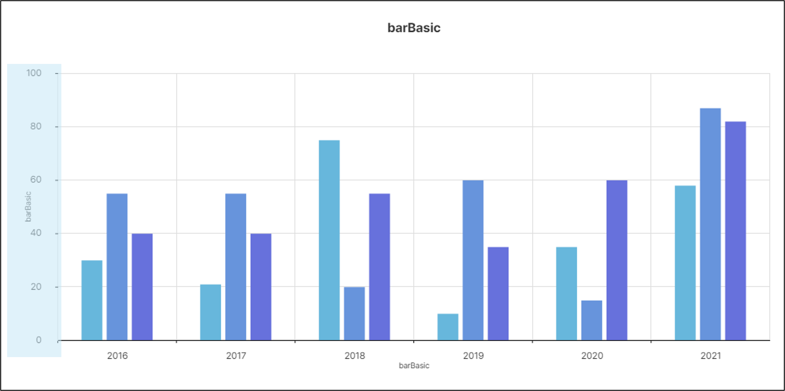

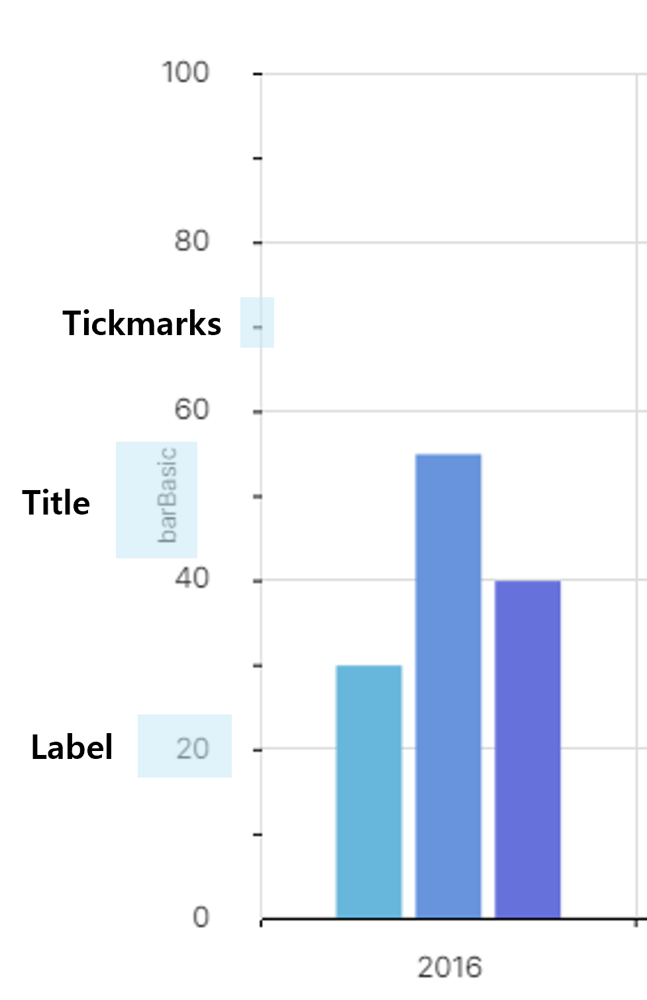{: width="250" height="300"}

<table style="width: 100%; text-align: center; border-collapse: collapse;">
  <thead>
    <tr>
      <th style="border: 1px solid black; padding: 10px;">Sub property</th>
      <th style="border: 1px solid black; padding: 10px;">설명</th>
      <th style="border: 1px solid black; padding: 10px;">타입</th>
      <th style="border: 1px solid black; padding: 10px;">기본값</th>
    </tr>
  </thead>
  <tbody>
    <tr>
      <td style="border: 1px solid black; padding: 10px;">AddLineSize</td>
      <td style="border: 1px solid black; padding: 10px;">y축 선의 길이를 지정합니다. 양수이면 원점에서 왼쪽으로 y축 길이가 늘어나며 음수이면 원점에서 오른쪽으로 y축 길이가 줄어듭니다.</td>
      <td style="border: 1px solid black; padding: 10px;">number</td>
      <td style="border: 1px solid black; padding: 10px;">0</td>
    </tr>
    <tr>
      <td style="border: 1px solid black; padding: 10px;">Color</td>
      <td style="border: 1px solid black; padding: 10px;">y축 선의 색을 지정합니다.</td>
      <td style="border: 1px solid black; padding: 10px;">string</td>
      <td style="border: 1px solid black; padding: 10px;">black</td>
    </tr>
    <tr>
      <td style="border: 1px solid black; padding: 10px;">LabelsColor</td>
      <td style="border: 1px solid black; padding: 10px;">y축 라벨의 색을 지정합니다.</td>
      <td style="border: 1px solid black; padding: 10px;">object</td>
      <td style="border: 1px solid black; padding: 10px;">null</td>
    </tr>
    <tr>
      <td style="border: 1px solid black; padding: 10px;">LabelsCount</td>
      <td style="border: 1px solid black; padding: 10px;">y축 라벨의 개수를 지정합니다. 라벨이 많아도 넘어도 지정한 만큼의 개수만 보여집니다.</td>
      <td style="border: 1px solid black; padding: 10px;">number</td>
      <td style="border: 1px solid black; padding: 10px;">5</td>
    </tr>
    <tr>
      <td style="border: 1px solid black; padding: 10px;">LabelsFontStyle</td>
      <td style="border: 1px solid black; padding: 10px;">y축 라벨의 글꼴 스타일을 지정합니다.</td>
      <td style="border: 1px solid black; padding: 10px;">string</td>
      <td style="border: 1px solid black; padding: 10px;">null</td>
    </tr>
    <tr>
      <td style="border: 1px solid black; padding: 10px;">LabelsHalign</td>
      <td style="border: 1px solid black; padding: 10px;">y축 라벨의 가로 정렬을 지정합니다.</td>
      <td style="border: 1px solid black; padding: 10px;">object</td>
      <td style="border: 1px solid black; padding: 10px;">null</td>
    </tr>
    <tr>
      <td style="border: 1px solid black; padding: 10px;">LabelsOffsetX</td>
      <td style="border: 1px solid black; padding: 10px;">y축 라벨의 가로 오프셋을 지정합니다.</td>
      <td style="border: 1px solid black; padding: 10px;">number</td>
      <td style="border: 1px solid black; padding: 10px;">0</td>
    </tr>
    <tr>
      <td style="border: 1px solid black; padding: 10px;">LabelsOffsetY</td>
      <td style="border: 1px solid black; padding: 10px;">y축 라벨의 세로 오프셋을 지정합니다.</td>
      <td style="border: 1px solid black; padding: 10px;">number</td>
      <td style="border: 1px solid black; padding: 10px;">0</td>
    </tr>
    <tr>
      <td style="border: 1px solid black; padding: 10px;">LabelsPosition</td>
      <td style="border: 1px solid black; padding: 10px;">y축 라벨의 포지션을 지정합니다. section, edge가 차트 유형별로 적용되어 있으며 수정이 불가능한 차트도 있습니다.</td>
      <td style="border: 1px solid black; padding: 10px;">string</td>
      <td style="border: 1px solid black; padding: 10px;">edge</td>
    </tr>
    <tr>
      <td style="border: 1px solid black; padding: 10px;">LabelsSpecific</td>
      <td style="border: 1px solid black; padding: 10px;">y축 라벨 값을 특정한 값으로 지정합니다.</td>
      <td style="border: 1px solid black; padding: 10px;">object</td>
      <td style="border: 1px solid black; padding: 10px;">null</td>
    </tr>
    <tr>
      <td style="border: 1px solid black; padding: 10px;">LabelsValign</td>
      <td style="border: 1px solid black; padding: 10px;">라벨의 세로 정렬을 지정합니다. top, bottom, center를 사용할 수 있습니다.</td>
      <td style="border: 1px solid black; padding: 10px;">object</td>
      <td style="border: 1px solid black; padding: 10px;">null</td>
    </tr>
    <tr>
      <td style="border: 1px solid black; padding: 10px;">LineWidth</td>
      <td style="border: 1px solid black; padding: 10px;">y축의 두께를 지정합니다.</td>
      <td style="border: 1px solid black; padding: 10px;">number</td>
      <td style="border: 1px solid black; padding: 10px;">1</td>
    </tr>
    <tr>
      <td style="border: 1px solid black; padding: 10px;">Position</td>
      <td style="border: 1px solid black; padding: 10px;">y축의 위치를 지정합니다. top, bottom, center를 사용할 수 있습니다.</td>
      <td style="border: 1px solid black; padding: 10px;">string</td>
      <td style="border: 1px solid black; padding: 10px;">left</td>
    </tr>
    <tr>
      <td style="border: 1px solid black; padding: 10px;">Scale</td>
      <td style="border: 1px solid black; padding: 10px;">y축 라벨의 규모를 보여줄 지 여부입니다. true면 데이터 값에 따라 y축에 라벨이 표현됩니다.</td>
      <td style="border: 1px solid black; padding: 10px;">boolean</td>
      <td style="border: 1px solid black; padding: 10px;">true</td>
    </tr>
    <tr>
      <td style="border: 1px solid black; padding: 10px;">ScaleDecimals</td>
      <td style ="border: 1px solid black; padding: 10px;">y축 라벨의 규모를 보여줄 때, 지정한 값만큼의 소수점을 표시합니다.</td>
      <td style="border: 1px solid black; padding: 10px;">number</td>
      <td style="border: 1px solid black; padding: 10px;">0</td>
    </tr>
    <tr>
      <td style="border: 1px solid black; padding: 10px;">ScaleFormatter</td>
      <td style="border: 1px solid black; padding: 10px;">y축 라벨 규모의 데이터를 특정한 형식으로 변환하거나 서식을 적용합니다.</td>
      <td style="border: 1px solid black; padding: 10px;">object</td>
      <td style="border: 1px solid black; padding: 10px;">null</td>
    </tr>
    <tr>
      <td style="border: 1px solid black; padding: 10px;">ScaleInvert</td>
      <td style="border: 1px solid black; padding: 10px;">y축 라벨 규모를 반전시킬 지 여부입니다.</td>
      <td style="border: 1px solid black; padding: 10px;">boolean</td>
      <td style="border: 1px solid black; padding: 10px;">false</td>
    </tr>
    <tr>
      <td style="border: 1px solid black; padding: 10px;">ScaleMax</td>
      <td style="border: 1px solid black; padding: 10px;">y축 라벨의 규모를 보여줄 때, 라벨의 최대값을 지정합니다.</td>
      <td style="border: 1px solid black; padding: 10px;">object</td>
      <td style="border: 1px solid black; padding: 10px;">null</td>
    </tr>
    <tr>
      <td style="border: 1px solid black; padding: 10px;">ScaleMin</td>
      <td style="border: 1px solid black; padding: 10px;">y축 라벨의 규모를 보여줄 때, 라벨의 최소값을 지정합니다.</td>
      <td style="border: 1px solid black; padding: 10px;">number</td>
      <td style="border: 1px solid black; padding: 10px;">0</td>
    </tr>
    <tr>
      <td style="border: 1px solid black; padding: 10px;">ScalePoint</td>
      <td style="border: 1px solid black; padding: 10px;">y축 라벨의 규모를 보여줄 때, 소수점 표시 방식을 지정합니다.</td>
      <td style="border: 1px solid black; padding: 10px;">string</td>
      <td style="border: 1px solid black; padding: 10px;">.</td>
    </tr>
    <tr>
      <td style="border: 1px solid black; padding: 10px;">ScaleRound</td>
      <td style="border: 1px solid black; padding: 10px;">y축 라벨의 규모를 반올림할 지 여부입니다.</td>
      <td style="border: 1px solid black; padding: 10px;">boolean</td>
      <td style="border: 1px solid black; padding: 10px;">false</td>
    </tr>
    <tr>
      <td style="border: 1px solid black; padding: 10px;">ScaleThousand</td>
      <td style="border: 1px solid black; padding: 10px;">y축 라벨의 규모를 보여줄 때, 천 단위 구분 기호를 지정합니다.</td>
      <td style="border: 1px solid black; padding: 10px;">string</td>
      <td style="border: 1px solid black; padding: 10px;">,</td>
    </tr>
    <tr>
      <td style="border: 1px solid black; padding: 10px;">ScaleUnitsPost</td>
      <td style="border: 1px solid black; padding: 10px;">y축 라벨의 규모를 보여줄 때, 뒤에 표시할 문자를 지정합니다.</td>
      <td style="border: 1px solid black; padding: 10px;">string</td>
      <td style="border: 1px solid black; padding: 10px;"></td>
    </tr>
    <tr>
      <td style="border: 1px solid black; padding: 10px;">ScaleUnitsPre</td>
      <td style="border: 1px solid black; padding: 10px;">y축 라벨의 규모를 보여줄 때, 앞에 표시할 문자를 지정합니다.</td>
      <td style="border: 1px solid black; padding: 10px;">string</td>
      <td style="border: 1px solid black; padding: 10px;"></td>
    </tr>
    <tr>
      <td style="border: 1px solid black; padding: 10px;">Tickmarks</td>
      <td style="border: 1px solid black; padding: 10px;">y축 라벨에 눈금을 표시할 지 여부입니다.</td>
      <td style="border: 1px solid black; padding: 10px;">boolean</td>
      <td style="border: 1px solid black; padding: 10px;">true</td>
    </tr>
    <tr>
      <td style="border: 1px solid black; padding: 10px;">TickmarksCount</td>
      <td style="border: 1px solid black; padding: 10px;">y축 라벨의 눈금 개수를 지정합니다.</td>
      <td style="border: 1px solid black; padding: 10px;">object</td>
      <td style="border: 1px solid black; padding: 10px;">null</td>
    </tr>
    <tr>
      <td style="border: 1px solid black; padding: 10px;">TickmarksLastBottom</td>
      <td style="border: 1px solid black; padding: 10px;">y축 라벨의 가장 아래쪽 마크를 표시할 지 여부입니다.</td>
      <td style="border: 1px solid black; padding: 10px;">object</td>
      <td style="border: 1px solid black; padding: 10px;">null</td>
    </tr>
    <tr>
      <td style="border: 1px solid black; padding: 10px;">TickmarksLastTop</td>
      <td style="border: 1px solid black; padding: 10px;">y축 라벨의 가장 위쪽 마크를 표시할 지 여부입니다.</td>
      <td style="border: 1px solid black; padding: 10px;">object</td>
      <td style="border: 1px solid black; padding: 10px;">null</td>
    </tr>
    <tr>
      <td style="border: 1px solid black; padding: 10px;">TickmarksLength</td>
      <td style="border: 1px solid black; padding: 10px;">y축 라벨의 데이터마다 위치한 마크값의 길이를 지정합니다.</td>
      <td style="border: 1px solid black; padding: 10px;">number</td>
      <td style="border: 1px solid black; padding: 10px;">3</td>
    </tr>
    <tr>
      <td style="border: 1px solid black; padding: 10px;">Title</td>
      <td style="border: 1px solid black; padding: 10px;">y축의 제목을 지정합니다.</td>
      <td style="border: 1px solid black; padding: 10px;">string</td>
      <td style="border: 1px solid black; padding: 10px;"></td>
    </tr>
    <tr>
      <td style="border: 1px solid black; padding: 10px;">TitleColor</td>
      <td style="border: 1px solid black; padding: 10px;">y축 제목의 색상을 지정합니다.</td>
      <td style="border: 1px solid black; padding: 10px;">object</td>
      <td style="border: 1px solid black; padding: 10px;">null</td>
    </tr>
    <tr>
      <td style="border: 1px solid black; padding: 10px;">TitleFontStyle</td>
      <td style="border: 1px solid black; padding: 10px;">y축 제목의 글꼴 스타일을 지정합니다.</td>
      <td style="border: 1px solid black; padding: 10px;">string</td>
      <td style="border: 1px solid black; padding: 10px;">null</td>
    </tr>
    <tr>
      <td style="border: 1px solid black; padding: 10px;">TitleHalign</td>
      <td style="border: 1px solid black; padding: 10px;">y축 제목의 가로 정렬을 지정합니다. 'left','right','center'를 사용할 수 있습니다.</td>
      <td style="border: 1px solid black; padding: 10px;">object</td>
      <td style="border: 1px solid black; padding: 10px;">null</td>
    </tr>
    <tr>
      <td style="border: 1px solid black; padding: 10px;">TitleOffsetX</td>
      <td style="border: 1px solid black; padding: 10px;">y축 제목의 가로 오프셋을 지정합니다.</td>
      <td style="border: 1px solid black; padding: 10px;">number</td>
      <td style="border: 1px solid black; padding: 10px;">0</td>
    </tr>
    <tr>
      <td style="border: 1px solid black; padding: 10px;">TitleOffsetY</td>
      <td style="border: 1px solid black; padding: 10px;">y축 제목의 세로 오프셋을 지정합니다.</td>
      <td style="border: 1px solid black; padding: 10px;">number</td>
      <td style="border: 1px solid black; padding: 10px;">0</td>
    </tr>
    <tr>
      <td style="border: 1px solid black; padding: 10px;">TitlePos</td>
      <td style="border: 1px solid black; padding: 10px;">y축 제목의 위치를 지정합니다. 양수일 때 아래로 내려가고 음수일 때 위로 올라갑니다.</td>
      <td style="border: 1px solid black; padding: 10px;">object</td>
      <td style="border: 1px solid black; padding: 10px;">null</td>
    </tr>
    <tr>
      <td style="border: 1px solid black; padding: 10px;">TitleValign</td>
      <td style="border: 1px solid black; padding: 10px;">y축 제목의 수직 정렬을 지정합니다. top, bottom, center를 사용할 수 있습니다.</td>
      <td style="border: 1px solid black; padding: 10px;">object</td>
      <td style="border: 1px solid black; padding: 10px;">null</td>
    </tr>
    <tr>
      <td style="border: 1px solid black; padding: 10px;">TitleX</td>
      <td style="border: 1px solid black; padding: 10px;">y축 제목의 가로 좌표를 지정합니다.</td>
      <td style="border: 1px solid black; padding: 10px;">object</td>
      <td style="border: 1px solid black; padding: 10px;">null</td>
    </tr>
    <tr>
      <td style="border: 1px solid black; padding: 10px;">TitleY</td>
      <td style="border: 1px solid black; padding: 10px;">y축 제목의 세로 좌표를 지정합니다.</td>
      <td style="border: 1px solid black; padding: 10px;">object</td>
      <td style="border: 1px solid black; padding: 10px;">null</td>
    </tr>
    <tr>
      <td style="border: 1px solid black; padding: 10px;">Use</td>
      <td style="border: 1px solid black; padding: 10px;">y축을 사용할 지 여부입니다.</td>
      <td style="border: 1px solid black; padding: 10px;">boolean</td>
      <td style="border: 1px solid black; padding: 10px;">true</td>
    </tr>
  </tbody>
</table>


#### Y축 Property 기본 예제

다음 예제는 Basic한 차트의 Y축 생성예제입니다.

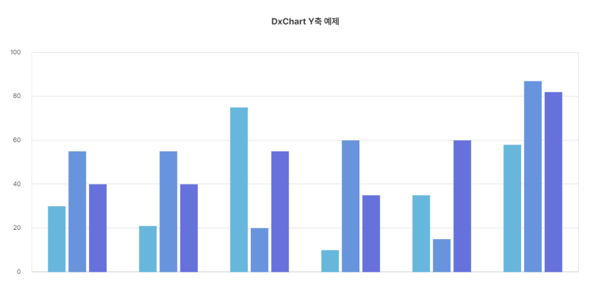

```javascript
var bar = new DxChartBar({
id: cvs,
elem : canvas,
binddataset : this.Dataset00,
data:["bind:total","bind:man","bind:woman"],
options: {
        yaxis: {
          // 차트의 Y축을 Draw 할지 설정할 수 있는 옵션입니다. 
          // 디폴트 값은 true입니다.
            Use : true, 
          // 차트 Y축 라벨 데이터값의 MAX값을 설정할 수 있습니다. 
            ScaleMax: 100, 
            Tickmarks:false,
          // 차트 Y축의 눈금선 개수 를 설정 할 수 있습니다.   
            TickmarksCount: 5,
          // 차트 Y축 선의 색상을 설정 할 수 있습니다.  
            Color:"#E2E2E2",
           //차트의 Y축과 라벨 사이 OffsetX값을 설정할 수 있습니다 
           //양수 음수 둘다 가능합니다..  
            LabelsOffsetX:-15, 
        }
      }

}).draw();
```

#### Y축 Property 기본 예제 (Labels 관련 예제)

 다음은 차트의 Y축 라벨에 관련된 기본 예제 입니다.
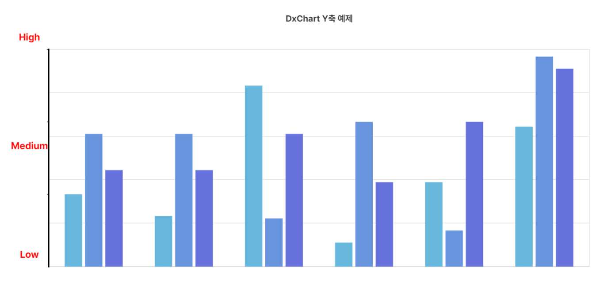

```javascript
var bar = new DxChartBar({
id: cvs,
elem : canvas,
binddataset : this.Dataset00,
data:["bind:total","bind:man","bind:woman"],
options: {
        yaxis: {
            Use : true, 
            // 차트의 Y축을 Draw 할지 설정할 수 있는 옵션입니다. 
            // 디폴트값은 true입니다.
            // 차트 Y축의 눈금선 사용 여부를 설정할 수 있습니다.
            // 디퐅트값은 true입니다.
              Tickmarks:true,
            // 차트 Y축의 눈금선 개수 를 설정 할 수 있습니다.   
              TickmarksCount: 3,
            // 차트 Y축 라인의 색상을 설정 할 수 있습니다.   
              Color:"#E2E2E2",
            // 차트 Y축 라벨 데이터 의 개수를 설정할 수 있습니다.
            //  기본적으로 바인딩된 데이터 값들의 평균값이 라벨로 설정 됩니다.   
              LabelsCount: 3,
            // 차트 Y축 라벨 데이터의 폰트 스타일을 설정할 수 있습니다. 
              LabelsFontStyle:'20px bold Pretendard', 
            // 차트 Y축 라벨 데이터의 가로정렬을 설정할 수 있습니다.
              LabelsHalign: 'center', 
            //차트의 Y축과 라벨 사이 OffsetX값을 설정할 수 있습니다 
            //양수 음수 둘다 가능합니다..
              LabelsOffsetX:-35, 
            //차트의 Y축과 라벨 사이 OffsetY값을 설정할 수 있습니다 
            //양수 음수 둘다 가능합니다..
              LabelsOffsetY: -15, 
            //차트의 Y축 라벨 데이터의 포지션을 설정할 수 있습니다. 
            //'section', 'edge'로 설정 가능합니다.
              LabelsPosition: 'edge', 

            //차트의 Y축 라벨  데이터를 바인딩된 데이터의 평균값이 아닌
            //특정한 값으로 설정할 수있습니다. Array 형식으로 설정이 가능합니다.
              LabelsSpecific:['High','Medium','Low'], 
            //차트의 Y축 라벨데이터의 세로정렬 값을 설정할 수있습니다.
              LabelsValign:'left', 
            // 트의 Y축 색상을 설정 할 수 있습니다.
              LineWidth:3, 
            // 차트의 Y축 포지션을 설정할 수 있습니다.
              Position:'left' ,
            //차트 Y축 라벨 데이터의 색상을 설정 할 수 있습니다.
              LabelsColor:'red', 
      }
  }
}).draw();
```

#### Y축 Property 기본 예제 (Scale 관련 예제)

다음은 Y축 Scale에 관련된 기본 예제 입니다.
Scale Properties는 기본적으로 Y축 라벨데이터와 연관되어 있습니다. Scale
설정에 따라서 차트의 데이터 값 표현이 달라질 수 있습니다.

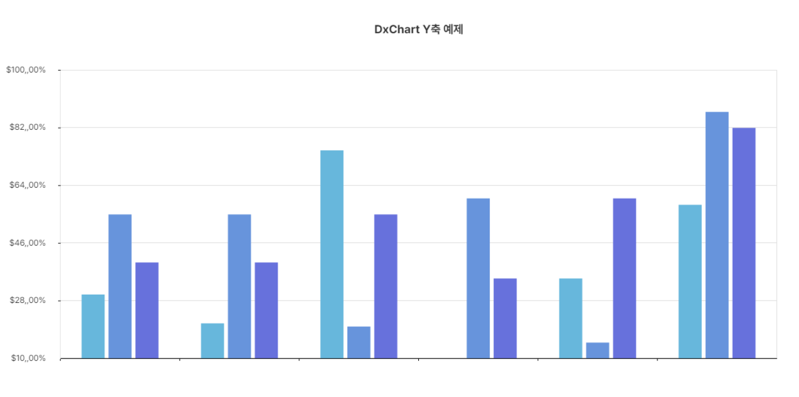

```javascript
var bar = new DxChartBar({
id: cvs,
elem : canvas,
binddataset : this.Dataset00,
data:["bind:total","bind:man","bind:woman"],
options: {
        yaxis: {
              Use : true,
              Color:"#E2E2E2",
              LabelsOffsetX:-15,
              //차트의 Y축 Scale값 표시 여부를 설정할 수 있습니다.  
              Scale: true,
              //차트의 Y축 Scale값을 반올림 표현을 할지 설정할 수 있습니다.
              // 예를들어 Scale의 최대값을 59로설정할시, 100으로 반올림하여 표현합니다.
              ScaleRound: true,
             //차트의 Y축 Scale의 최대값을 설정할 수 있습니다. 
             //설정값에 따라 차트의데이터 표현형태가 달라지므로, 
             //차트의 형태도 달라질수 있습니다.
              ScaleMax: 59, 
             //차트의 Y축 Scale의 최솟값을 설정할 수 있습니다.
             //설정값에 따라 차트의 데이터 표현형태가 달라지므로, 
             //차트의 형태도 달라질수 있습니다.
              ScaleMin:10,
             //차트의 Y축 Scale 값 뒤에 문자를 설정 할 수 있습니다.
              ScaleUnitsPost: '%',
             //차트의 Y축 Scale 값 앞에 문자를 설정 할 수 있습니다. 
              ScaleUnitsPre:'$',
             //차트의 Y축 Scale 소수점 자릿 수를 설정 할 수 있습니다. 
              ScaleDecimals: 2,
             //차트의 Y축 Scale의 최대값과 최소값을 Invert하여 표시할 수 있습니다.
              ScaleInvert:false, 
             //차트의 Y축 Scale 값 소수점 구분점을 설정할 수 있습니다. 
              ScalePoint: ',,',
             //차트의 Y축 Scale 값 천단위 구분점을 설정할 수 있습니다. 
              ScaleThousand:'..' 
          }
        }
}).draw();
```

#### Y축 Property ScaleFormatter예제 (Scale 관련 예제)

ScaleFormatter는 Y축 Sclae 데이터 값을<br>
바인딩된 데이터값과 다르게 표현할수 있는 Properties 입니다.<br>
옵션 객체 안에서 함수형태로 선언하여 사용할 수 있습니다.

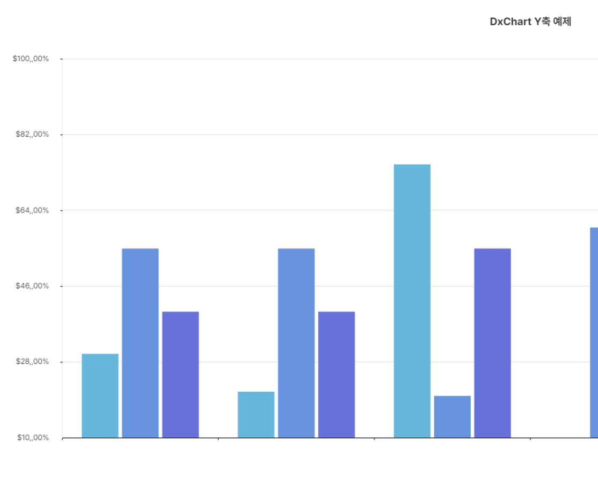

앞선 예제의 Y축 Scale값입니다. ScaleFormatter 프로퍼티를 통해서 해당
값을 다른값으로 표현할수 있습니다.

```javascript
var bar = new DxChartBar({
id: cvs,
elem : canvas,
binddataset : this.Dataset00,
data:["bind:total","bind:man","bind:woman"],
options: {
//기본적으로 ScaleFormatter는 yaxis에 관련된 프로퍼티이기 때문에
// yaxis 객체안에 선언합니다.
        yaxis: {
        ScaleFormatter : function (e)
          {
        //yaxis의 Scale값은 바인딩된 데이터 값이기 때문에, 
        // Number형식을 따릅니다


        //매개변수 e는 바인딩된 데이터값이 넘어오게되며, 
        //설정하고 싶은 값을 변수에 담아줍니다.
        var num = Number(e.number) \* 6;
        //설정된 값을 String으로 변환해 반환합니다. 
        return String(num) 
          }
        }
    }
}).draw();
```

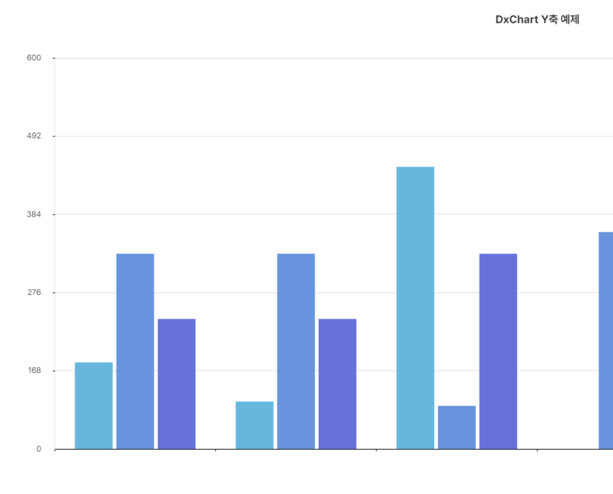


Sclae값에 \*6을 한 데이터를 반환한
결과입니다. SclaeFormmater를 설정하게되면, 기존에 설정했던 Scale 구분점
값이나, Post, Pre값들은 초기화 되게 됩니다.

이와 같이 Scale 데이터 값을 특정 값으로 표현할 수 있습니다.


#### Y축 Property 기본 예제 (Tickmarks 관련 예제) 
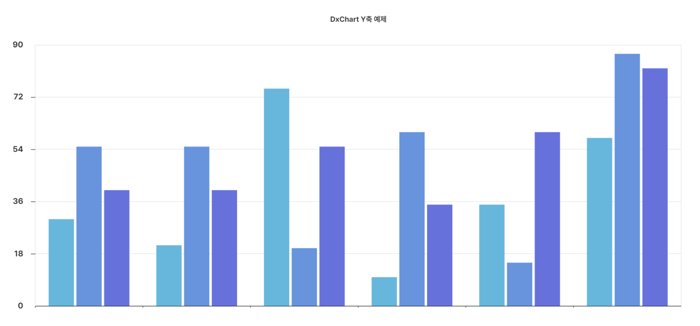

```javascript
var bar = new DxChartBar({
id: cvs,
elem : canvas,
binddataset : this.Dataset00,
data:["bind:total","bind:man","bind:woman"],
options: {

      yaxis: { //기본적인 설정은 Basic예제와 동일합니다
        Tickmarks: true, //차트 Y축의 눈금선 표시여부를 설정할 수 있습니다.
        TickmarksCount: 5, //차트 Y축의 눈금선 표시여부를 설정할 수 있습니다.
        TickmarksLastBottom:false, //차트 Y축의 눈금선 표시여부를 설정할 수있습니다.
        TickmarksLastTop:false, //차트 Y축의 눈금선 표시여부를 설정할 수 있습니다.
        TickmarksLength: 10, //차트 Y축의 눈금선 표시여부를 설정할 수 있습니다.
        LabelsFontStyle: '20px bold Pretendard'
      }
  }
}).draw();
```

#### Y축 Property 기본 예제 (title 관련 예제)

다음은 Y축 title에 관한 기본 예제입니다.


```javascript
var bar = new DxChartBar({
id: cvs,
elem : canvas,
binddataset : this.Dataset00,
data:["bind:total","bind:man","bind:woman"],
options: {
      yaxis: { //기본적인 설정은 Basic예제와 동일합니다
          Use : true,
          Color:"#E2E2E2",
          LabelsOffsetX:-15, //y축과 label 사이 15px 설정
          //차트 Y축 타이틀을 설정할 수 있습니다.
          Title:'DxChart 튜토리얼',
           //차트 Y축 타이틀을 색상을 설정할 수 있습니다. 
          TitleColor:'red',
          //차트 Y축 타이틀 폰트 스타일을설정할 수 있습니다.
          TitleFontStyle:'18px bold Pretendard',
          //차트 Y축 타이틀 가로정렬을 설정할수 있습니다.   'left','right','cetner'.
          TitleHalign:'center', 
         //차트 Y축 타이틀 OffsetX 값을 설정할 수 있습니다.
          TitleOffsetX:80,
          //차트 Y축 타이틀 OffsetY 값을 설정할 수 있습니다. 
          TitleOffsetY:-20,
          //차트 Y축 타이틀을 설정할 수 있습니다. 
          TitlePos:-20,
          //차트 Y축 타이틀 세로정렬 값 을 설정할 수 있습니다 
          TitleValign:'cetner',
          //차트 Y축 타이틀 X좌표값 을 설정할 수 있습니다.
          TitleX:50,
          //차트 Y축 타이틀 Y좌표값 을 설정할 수 있습니다. 
          TitleY:400 
      }
    }
}).draw();
```

### 2.6 Background 설정하기
---

차트의 Background를 설정합니다.

  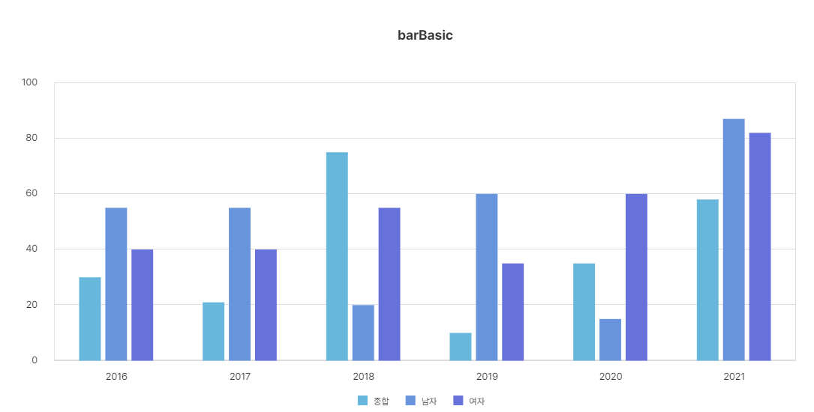

**Properties**
  <table style="border-collapse: collapse; width: 100%; margin: auto;">
    <thead>
      <tr>
        <th style="border: 1px solid black; padding: 10px;">Sub property</th>
        <th style="border: 1px solid black; padding: 10px;">설명</th>
        <th style="border: 1px solid black; padding: 10px;">타입</th>
        <th style="border: 1px solid black; padding: 10px;">기본값</th>
      </tr>
    </thead>
    <tbody>
      <tr>
        <td style="border: 1px solid black; padding: 10px;">BarsColor1</td>
        <td style="border: 1px solid black; padding: 10px;">배경에서 막대의 가로 색상을 지정합니다. 지정한 색이 홀수 번째에 반복됩니다.</td>
        <td style="border: 1px solid black; padding: 10px;">string</td>
        <td style="border: 1px solid black; padding: 10px;">rgba(0,0,0,0)</td>
      </tr>
      <tr>
        <td style="border: 1px solid black; padding: 10px;">BarsColor2</td>
        <td style="border: 1px solid black; padding: 10px;">배경에서 막대의 가로 색상을 지정합니다. 지정한 색이 짝수 번째에 반복됩니다.</td>
        <td style="border: 1px solid black; padding: 10px;">string</td>
        <td style="border: 1px solid black; padding: 10px;">rgba(0,0,0,0)</td>
      </tr>
      <tr>
        <td style="border: 1px solid black; padding: 10px;">BarsCount</td>
        <td style="border: 1px solid black; padding: 10px;">배경의 막대 개수를 지정합니다.</td>
        <td style="border: 1px solid black; padding: 10px;">object</td>
        <td style="border: 1px solid black; padding: 10px;">null</td>
      </tr>
      <tr>
        <td style="border: 1px solid black; padding: 10px;">Color</td>
        <td style="border: 1px solid black; padding: 10px;">차트의 여백을 제외한 배경 색을 지정합니다.</td>
        <td style="border: 1px solid black; padding: 10px;">object</td>
        <td style="border: 1px solid black; padding: 10px;">null</td>
      </tr>
      <tr>
        <td style="border: 1px solid black; padding: 10px;">Grid</td>
        <td style="border: 1px solid black; padding: 10px;">배경에 그리드를 표시할 지 여부입니다.</td>
        <td style="border: 1px solid black; padding: 10px;">number</td>
        <td style="border: 1px solid black; padding: 10px;">1</td>
      </tr>
      <tr>
        <td style="border: 1px solid black; padding: 10px;">GridAutofit</td>
        <td style="border: 1px solid black; padding: 10px;">배경 그리드의 픽셀 너비/높이를 지정하는 대신 자동 맞춤을 사용할 지 여부입니다.</td>
        <td style="border: 1px solid black; padding: 10px;">boolean</td>
        <td style="border: 1px solid black; padding: 10px;">TRUE</td>
      </tr>
      <tr>
        <td style="border: 1px solid black; padding: 10px;">GridAutofitAlign</td>
        <td style="border: 1px solid black; padding: 10px;">배경 그리드 autofit을 사용했을 때 정렬을 사용할 지 여부입니다.</td>
        <td style="border: 1px solid black; padding: 10px;">boolean</td>
        <td style="border: 1px solid black; padding: 10px;">TRUE</td>
      </tr>
      <tr>
        <td style="border: 1px solid black; padding: 10px;">GridBorder</td>
        <td style="border: 1px solid black; padding: 10px;">배경 그리드 주위에 테두리를 그릴지 여부입니다.</td>
        <td style="border: 1px solid black; padding: 10px;">boolean</td>
        <td style="border: 1px solid black; padding: 10px;">TRUE</td>
      </tr>
      <tr>
        <td style="border: 1px solid black; padding: 10px;">GridColor</td>
        <td style="border: 1px solid black; padding: 10px;">배경 그리드의 색을 지정합니다.</td>
        <td style="border: 1px solid black; padding: 10px;">string</td>
        <td style="border: 1px solid black; padding: 10px;">#dddddd</td>
      </tr>
      <tr>
        <td style="border: 1px solid black; padding: 10px;">GridDashed</td>
        <td style="border: 1px solid black; padding: 10px;">배경 그리드를 대시(-) 형태로 표현할 지 여부입니다.</td>
        <td style="border: 1px solid black; padding: 10px;">boolean</td>
        <td style="border: 1px solid black; padding: 10px;">FALSE</td>
      </tr>
      <tr>
        <td style="border: 1px solid black; padding: 10px;">GridDotted</td>
        <td style="border: 1px solid black; padding: 10px;">배경 그리드를 점(.) 형태로 표현할 지 여부입니다.</td>
        <td style="border: 1px solid black; padding: 10px;">boolean</td>
        <td style="border: 1px solid black; padding: 10px;">FALSE</td>
      </tr>
      <tr>
        <td style="border: 1px solid black; padding: 10px;">GridHlines</td>
        <td style="border: 1px solid black; padding: 10px;">배경 그리드의 가로 선을 그릴지 여부입니다.</td>
        <td style="border: 1px solid black; padding: 10px;">boolean</td>
        <td style="border: 1px solid black; padding: 10px;">TRUE</td>
      </tr>
      <tr>
        <td style="border: 1px solid black; padding: 10px;">GridHlinesCount</td>
        <td style="border: 1px solid black; padding: 10px;">배경 그리드의 가로 선 수를 지정합니다.</td>
        <td style="border: 1px solid black; padding: 10px;">number</td>
        <td style="border: 1px solid black; padding: 10px;">5</td>
      </tr>
      <tr>
        <td style="border: 1px solid black; padding: 10px;">GridHsize</td>
        <td style="border: 1px solid black; padding: 10px;">배경 그리드의 가로 크기를 지정합니다. backgroundGridAutofit 옵션이 false일 때만 동작합니다.</td>
        <td style="border: 1px solid black; padding: 10px;">number</td>
        <td style="border: 1px solid black; padding: 10px;">25</td>
      </tr>
      <tr>
        <td style="border: 1px solid black; padding: 10px;">GridLineWidth</td>
        <td style="border: 1px solid black; padding: 10px;">배경 그리드 선의 두께를 지정합니다. 소수점도 허용됩니다.</td>
        <td style="border: 1px solid black; padding: 10px;">number</td>
        <td style="border: 1px solid black; padding: 10px;">1</td>
      </tr>
      <tr>
        <td style="border: 1px solid black; padding: 10px;">GridThreedYaxis</td>
        <td style="border: 1px solid black; padding: 10px;">3D 차트를 그렸을 때 배경 그리드가 Y축으로 확장할 지 여부입니다.</td>
        <td style="border: 1px solid black; padding: 10px;">boolean</td>
        <td style="border: 1px solid black; padding: 10px;">TRUE</td>
      </tr>
      <tr>
        <td style="border: 1px solid black; padding: 10px;">GridVlines</td>
        <td style="border: 1px solid black; padding: 10px;">배경 그리드의 세로 선을 그릴지 여부입니다.</td>
        <td style="border: 1px solid black; padding: 10px;">boolean</td>
        <td style="border: 1px solid black; padding: 10px;">TRUE</td>
      </tr>
      <tr>
        <td style="border: 1px solid black; padding: 10px;">GridVsize</td>
        <td style="border: 1px solid black; padding: 10px;">배경 그리드의 세로 크기를 지정합니다. backgroundGridAutofit 옵션이 false일 때만 동작합니다.</td>
        <td style="border: 1px solid black; padding: 10px;">number</td>
        <td style="border: 1px solid black; padding: 10px;">25</td>
      </tr>
      <tr>
        <td style="border: 1px solid black; padding: 10px;">Hbars</td>
        <td style="border: 1px solid black; padding: 10px;">배경 그리드의 특정 위치에 특정 크기의 가로 막대를 지정합니다. 첫 번째 값은 데이터 범위 내에 있어야 표시됩니다. 두 번째 값은 크기를 지정하며 마지막 값은 색을 지정합니다. []안에 ,로 구분하여 여러 막대를 여러 위치에 그릴 수 있습니다. background : {Hbars : [[70, 10, 'yellow'], [120, 20, 'blue']]}</td>
        <td style="border: 1px solid black; padding: 10px;">object</td>
        <td style="border: 1px solid black; padding: 10px;">[]</td>
      </tr>
      <tr>
        <td style="border: 1px solid black; padding: 10px;">Image</td>
        <td style="border: 1px solid black; padding: 10px;">배경에 사용할 이미지를 지정합니다.</td>
        <td style="border: 1px solid black; padding: 10px;">object</td>
        <td style="border: 1px solid black; padding: 10px;">null</td>
      </tr>
      <tr>
        <td style="border: 1px solid black; padding: 10px;">ImageAlign</td>
        <td style="border: 1px solid black; padding: 10px;">배경 이미지를 정렬을 지정합니다. top, bottom, left, right 등을 기본적으로 사용 가능하며 top left, bottom right 등 응용도 가능합니다.</td>
        <td style="border: 1px solid black; padding: 10px;">object</td>
        <td style="border: 1px solid black; padding: 10px;">null</td>
      </tr>
      <tr>
        <td style="border: 1px solid black; padding: 10px;">ImageAlpha</td>
        <td style="border: 1px solid black; padding: 10px;">배경 이미지의 투명도를 지정합니다. 0~1까지 지정할 수 있으며 작아질수록 투명해집니다.</td>
        <td style="border: 1px solid black; padding: 10px;">number</td>
        <td style="border: 1px solid black; padding: 10px;">1</td>
      </tr>
      <tr>
        <td style="border: 1px solid black; padding: 10px;">ImageH</td>
        <td style="border: 1px solid black; padding: 10px;">배경 이미지의 높이를 지정합니다.</td>
        <td style="border: 1px solid black; padding: 10px;">object</td>
        <td style="border: 1px solid black; padding: 10px;">null</td>
      </tr>
      <tr>
        <td style="border: 1px solid black; padding: 10px;">ImageStretch</td>
        <td style="border: 1px solid black; padding: 10px;">배경 이미지가 차트에 맞게 확장될 지 여부입니다.</td>
        <td style="border: 1px solid black; padding: 10px;">boolean</td>
        <td style="border: 1px solid black; padding: 10px;">TRUE</td>
      </tr>
      <tr>
        <td style="border: 1px solid black; padding: 10px;">ImageW</td>
        <td style="border: 1px solid black; padding: 10px;">배경 이미지의 길이를 지정합니다.</td>
        <td style="border: 1px solid black; padding: 10px;">object</td>
        <td style="border: 1px solid black; padding: 10px;">null</td>
      </tr>
      <tr>
        <td style="border: 1px solid black; padding: 10px;">ImageX</td>
        <td style="border: 1px solid black; padding: 10px;">배경 이미지의 가로 좌표를 지정합니다.</td>
        <td style="border: 1px solid black; padding: 10px;">object</td>
        <td style="border: 1px solid black; padding: 10px;">null</td>
      </tr>
      <tr>
        <td style="border: 1px solid black; padding: 10px;">ImageY</td>
        <td style="border: 1px solid black; padding: 10px;">배경 이미지의 세로 좌표를 지정합니다.</td>
        <td style="border: 1px solid black; padding: 10px;">object</td>
        <td style="border: 1px solid black; padding: 10px;">null</td>
      </tr>
    </tbody>
  </table>


#### Background Grid 속성

Background Grid 속성을 설정할 수 있습니다.

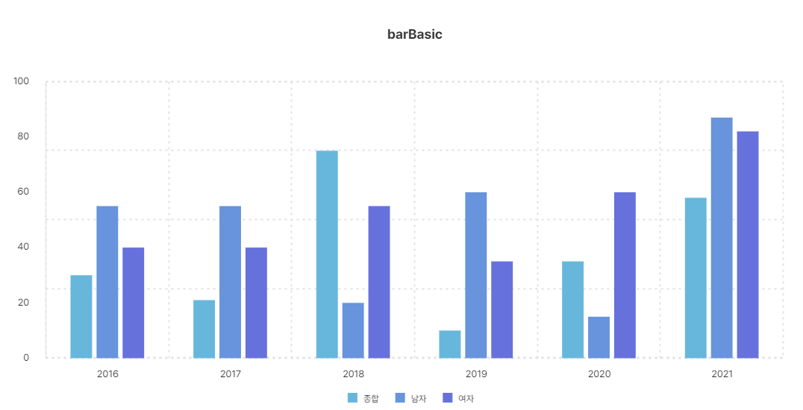

```javascript

 var bar = new DxChartBar({
                                                                           
 id:cvs,                                                                       
 elem : canvas,                                                             
 binddataset : this.Dataset00
 data:["bind:total","bind:man","bind:woman"],
        options:{                       
        //기본적인 설정은 Basic예제와 동일합니다                                       
        background:{                                                          
             Grid: true //Grid 옵션을 설정합니다.                                  
            ,GridColor:"#E2E2E2" //Grid의 색상을 설정합니다.                             
            ,GridDashed:true //Grid의 점 및 선 형태를 설정합니다.                                                                   
            ,GridDotted:false //Grid의 점 및 선 형태를 설정합니다.                                                          
            ,GridHlinesCount:4 //Grid의 가로 선의 개수를 지정합니다.             
            ,GridLineWidth:2 //Grid의 선의 굵기를 지정합니다.                      
          }                                                                   
        }                                                                      
 }).draw();                                                            
```

#### Background 색상 설정하기

Background 색상 지정 가능합니다.

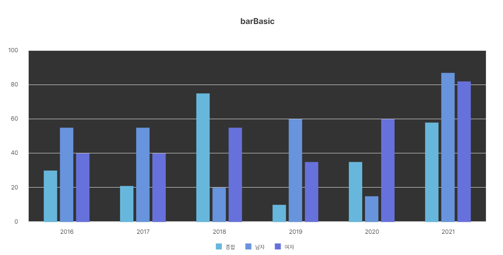

```javascript
  var bar = new DxChartBar({
      id: cvs,
      elem: canvas,
      binddataset: this.Dataset00,
      data: ["bind:total", "bind:man", "bind:woman"],
      options: {
          // 기본적인 설정은 Basic 예제와 동일합니다
          background: {
              Color: "#333", // BackGroud Color를 설정합니다.
              GridVlines: false, // Grid의 수직 선을 미설정합니다
              GridBorder: true // Grid Border를 설정합니다.
          }
      }
  }).draw();
```

#### Background Image 설정하기

Background Image 설정이 가능합니다.


```javascript
var bar = new DxChartBar({
    id: cvs,
    elem: canvas,
    binddataset: this.Dataset00,
    data: ["bind:total", "bind:man", "bind:woman"],
    options: {
        // 기본적인 설정은 Basic 예제와 동일합니다
        background: {
            Image: 'images::barBg1.png', // 이미지 경로를 설정합니다.
            ImageAlpha: 0.3, // 이미지의 알파 값을 설정합니다.
            Grid: false // Grid는 사용안함으로 설정합니다.
        }
    }
}).draw();
```

### 2.7 Label 설정하기
---


**Properties**

<table style="border-collapse: collapse; width: 100%; margin: auto;">
  <thead>
    <tr>
      <th style="border: 1px solid black; padding: 10px; text-align: center; background-color: #f2f2f2;">Sub property</th>
      <th style="border: 1px solid black; padding: 10px; text-align: center; background-color: #f2f2f2;">설명</th>
      <th style="border: 1px solid black; padding: 10px; text-align: center; background-color: #f2f2f2;">타입</th>
      <th style="border: 1px solid black; padding: 10px; text-align: center; background-color: #f2f2f2;">기본값</th>
    </tr>
  </thead>
  <tbody>
    <tr>
      <td style="border: 1px solid black; padding: 10px;">Above</td>
      <td style="border: 1px solid black; padding: 10px;">차트 요소 위에 라벨을 표시할 지 여부입니다.</td>
      <td style="border: 1px solid black; padding: 10px;">boolean</td>
      <td style="border: 1px solid black; padding: 10px;">FALSE</td>
    </tr>
    <tr>
      <td style="border: 1px solid black; padding: 10px;">AboveAngle</td>
      <td style="border: 1px solid black; padding: 10px;">차트 요소 위에 라벨을 표시했을 때, 라벨의 각도를 지정합니다.</td>
      <td style="border: 1px solid black; padding: 10px;">object</td>
      <td style="border: 1px solid black; padding: 10px;">null</td>
    </tr>
    <tr>
      <td style="border: 1px solid black; padding: 10px;">AboveBackground</td>
      <td style="border: 1px solid black; padding: 10px;">차트 요소 위에 라벨을 표시했을 때, 라벨의 배경 색을 지정합니다.</td>
      <td style="border: 1px solid black; padding: 10px;">string</td>
      <td style="border: 1px solid black; padding: 10px;">rgba(0,0,0,0)</td>
    </tr>
    <tr>
      <td style="border: 1px solid black; padding: 10px;">AboveBorderStyle</td>
      <td style="border: 1px solid black; padding: 10px;">차트 요소 위에 라벨을 표시했을 때, 라벨의 테두리 스타일을 지정합니다.</td>
      <td style="border: 1px solid black; padding: 10px;">string</td>
      <td style="border: 1px solid black; padding: 10px;">null</td>
    </tr>
    <tr>
      <td style="border: 1px solid black; padding: 10px;">AboveColor</td>
      <td style="border: 1px solid black; padding: 10px;">차트 요소 위에 라벨을 표시했을 때, 라벨 텍스트의 색을 지정합니다.</td>
      <td style="border: 1px solid black; padding: 10px;">object</td>
      <td style="border: 1px solid black; padding: 10px;">null</td>
    </tr>
    <tr>
      <td style="border: 1px solid black; padding: 10px;">AboveDecimals</td>
      <td style="border: 1px solid black; padding: 10px;">차트 요소 위에 라벨을 표시했을 때, 지정한 값만큼의 소수점을 표시합니다.</td>
      <td style="border: 1px solid black; padding: 10px;">number</td>
      <td style="border: 1px solid black; padding: 10px;">0</td>
    </tr>
    <tr>
      <td style="border: 1px solid black; padding: 10px;">AboveFontStyle</td>
      <td style="border: 1px solid black; padding: 10px;">차트 요소 위에 라벨을 표시했을 때, 라벨의 글꼴 스타일을 지정합니다.</td>
      <td style="border: 1px solid black; padding: 10px;">string</td>
      <td style="border: 1px solid black; padding: 10px;">null</td>
    </tr>
    <tr>
      <td style="border: 1px solid black; padding: 10px;">AboveFormatter</td>
      <td style="border: 1px solid black; padding: 10px;">차트 요소 위에 라벨을 표시했을 때, 라벨의 데이터를 특정한 형식으로 변환하거나 서식을 적용합니다.</td>
      <td style="border: 1px solid black; padding: 10px;">object</td>
      <td style="border: 1px solid black; padding: 10px;">null</td>
    </tr>
    <tr>
      <td style="border: 1px solid black; padding: 10px;">AboveOffset</td>
      <td style="border: 1px solid black; padding: 10px;">차트 요소 위에 라벨을 표시했을 때, 라벨의 오프셋을 지정합니다. 이 오프셋을 지정하면 세로 오프셋을 지정한 것과 동일합니다.</td>
      <td style="border: 1px solid black; padding: 10px;">object</td>
      <td style="border: 1px solid black; padding: 10px;">null</td>
    </tr>
    <tr>
      <td style="border: 1px solid black; padding: 10px;">AboveOffsetX</td>
      <td style="border: 1px solid black; padding: 10px;">차트 요소 위에 라벨을 표시했을 때, 라벨의 가로 오프셋을 지정합니다.</td>
      <td style="border: 1px solid black; padding: 10px;">number</td>
      <td style="border: 1px solid black; padding: 10px;">0</td>
    </tr>
    <tr>
      <td style="border: 1px solid black; padding: 10px;">AboveOffsetY</td>
      <td style="border: 1px solid black; padding: 10px;">차트 요소 위에 라벨을 표시했을 때, 라벨의 세로 오프셋을 지정합니다.</td>
      <td style="border: 1px solid black; padding: 10px;">number</td>
      <td style="border: 1px solid black; padding: 10px;">0</td>
    </tr>
    <tr>
      <td style="border: 1px solid black; padding: 10px;">AbovePoint</td>
      <td style="border: 1px solid black; padding: 10px;">차트 요소 위에 라벨을 표시했을 때, 라벨의 소수점이 나올 자리의 구분 기호를 지정합니다.</td>
      <td style="border: 1px solid black; padding: 10px;">string</td>
      <td style="border: 1px solid black; padding: 10px;">.</td>
    </tr>
    <tr>
      <td style="border: 1px solid black; padding: 10px;">AboveSpecific</td>
      <td style="border: 1px solid black; padding: 10px;">차트 요소 위에 라벨을 표시했을 때, 라벨 값을 특정한 값으로 지정합니다.</td>
      <td style="border: 1px solid black; padding: 10px;">object</td>
      <td style="border: 1px solid black; padding: 10px;">null</td>
    </tr>
    <tr>
      <td style="border: 1px solid black; padding: 10px;">AboveThousand</td>
      <td style="border: 1px solid black; padding: 10px;">차트 요소 위에 라벨을 표시했을 때, 라벨의 천 단위 구분 기호를 지정합니다.</td>
      <td style="border: 1px solid black; padding: 10px;">string</td>
      <td style="border: 1px solid black; padding: 10px;">,</td>
    </tr>
    <tr>
      <td style="border: 1px solid black; padding: 10px;">AboveUnitsPost</td>
      <td style="border: 1px solid black; padding: 10px;">차트 요소 위에 라벨을 표시했을 때, 라벨의 데이터 뒤에 표시할 문자를 지정합니다.</td>
      <td style="border: 1px solid black; padding: 10px;">string</td>
      <td style="border: 1px solid black; padding: 10px;"></td>
    </tr>
    <tr>
      <td style="border: 1px solid black; padding: 10px;">AboveUnitsPre</td>
      <td style="border: 1px solid black; padding: 10px;">차트 요소 위에 라벨을 표시했을 때, 라벨의 데이터 앞에 표시할 문자를 지정합니다.</td>
      <td style="border: 1px solid black; padding: 10px;">string</td>
      <td style="border: 1px solid black; padding: 10px;"></td>
    </tr>
    <tr>
      <td style="border: 1px solid black; padding: 10px;">Ingraph</td>
      <td style="border: 1px solid black; padding: 10px;">차트 내부에 그려지는 라벨을 사용할 지 여부입니다.</td>
      <td style="border: 1px solid black; padding: 10px;">object</td>
      <td style="border: 1px solid black; padding: 10px;">null</td>
    </tr>
    <tr>
      <td style="border: 1px solid black; padding: 10px;">IngraphColor</td>
      <td style="border: 1px solid black; padding: 10px;">차트 내부 라벨의 색을 지정합니다.</td>
      <td style="border: 1px solid black; padding: 10px;">object</td>
      <td style="border: 1px solid black; padding: 10px;">null</td>
    </tr>
    <tr>
      <td style="border: 1px solid black; padding: 10px;">IngraphFontStyle</td>
      <td style="border: 1px solid black; padding: 10px;">차트 내부 라벨의 글꼴 스타일을 지정합니다.</td>
      <td style="border: 1px solid black; padding: 10px;">string</td>
      <td style="border: 1px solid black; padding: 10px;">null</td>
    </tr>
    <tr>
      <td style="border: 1px solid black; padding: 10px;">IngraphOffsetX</td>
      <td style="border: 1px solid black; padding: 10px;">차트 내부 라벨의 가로 오프셋을 지정합니다.</td>
      <td style="border: 1px solid black; padding: 10px;">number</td>
      <td style="border: 1px solid black; padding: 10px;">0</td>
    </tr>
    <tr>
      <td style="border: 1px solid black; padding: 10px;">IngraphOffsetY</td>
      <td style="border: 1px solid black; padding: 10px;">차트 내부 라벨의 세로 오프셋을 지정합니다.</td>
      <td style="border: 1px solid black; padding: 10px;">number</td>
      <td style="border: 1px solid black; padding: 10px;">0</td>
    </tr>
  </tbody>
</table>


#### Lable Above 설정하기

Lable를 해당 차트 위에 표시할 수 있습니다.


```javascript
var bar = new DxChartBar({
    id: 'cvs',
    elem: 'canvas',
    binddataset: this.Dataset00,
    data: ["bind:total", "bind:man", "bind:woman"],
    options: {
        // 기본적인 설정은 Basic 예제와 동일합니다
        labels: {
            Above: true, // labelsAbocve를 설정합니다.
            //labelsAbocve의 Background색상을 설정합니다
            AboveBackground:'rgba(255,255,255,0.75)', 
        }
    }
}).draw();
```
#### Lable Above Image 설정하기

Lable의 이미지를 포함하여 차트 위에 표시할 수 있습니다. (**Single bar**만
지원합니다)


```javascript
var bar = new DxChartBar({
    id: 'cvs',
    elem: 'canvas',
    binddataset: this.Dataset00,
    data: ["bind:val"],
    options: {
       // Xaxis를 설정합니다.
        xaxis: {
            Labels: ['bind:year'],
            Color: "#E2E2E2",
            LabelsOffsetY: 5,
            Tickmarks: false
        },
    // Yaxis를 설정합니다.
        yaxis: {
            Color: "#E2E2E2",
            LabelsOffsetX: -15,
            Tickmarks: false
        },
   // margin은 Basic예제와 동일합니다
        margin: {
         
        },
   // Title를 설정합니다.
        title: {
            Text: "bar Sample",
            Y: 73,
            SubtitleOffsetY: 8
        },
  // colorsSequential true 설정 시 default color 순차적으로 보여줍니다.
        colorsSequential: true,
       
        labels: {
            // labels Above를 미설정합니다.
            Above: false,
            // labels Image를 설정합니다.
            AboveImage: true,
            // labels Above 이미지 사이 gap을 설정합니다.
            AboveImageGap: 10,
            // labels 이미지 url를 설정합니다.
            AboveImageUrl: [
                'images::nation/korea.png',
                'images::nation/japan.png',
            ],
            // labels Above 이미지 너비를 설정합니다.
            AboveImageWidth: 100,
            // labels Above 이미지 높이를 설정합니다.
            AboveImageHeight: 50,
            // labels Above 이미지 테두리 선의 굵기를 설정합니다.
            AboveImageLineWidth: 0
    
        }
    }
}).draw();
```

#### Label Ingraph 설정하기

 차트 안에 Label을 표시할 수 있습니다.

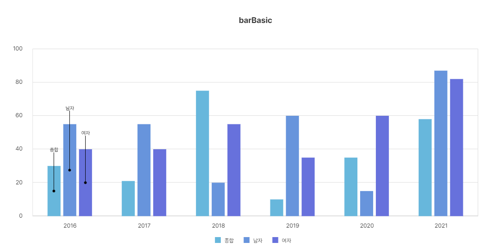


```javascript
var bar = new DxChartBar({
    id: 'cvs',
    elem: 'canvas',
    binddataset: this.Dataset00,
    data: ["bind:total", "bind:man", "bind:woman"],
    options: {
        // 기본적인 설정은 Basic예제와 동일합니다

        labels: {
           // Ingraph 데이터를 설정합니다.
            Ingraph: ['종합', '남자', '여자'],
           // Ingraph 레이블 위치를 설정합니다. (Top false 시 차트 안에서 표시)
            IngraphLabelTop: true,
           // IngraphTextBound 데이터를 설정합니다.
            IngraphTextBound: false
        }
    }
}).draw();
```

### 2.8 범례 설정하기
---
차트의 범례를 설정합니다.

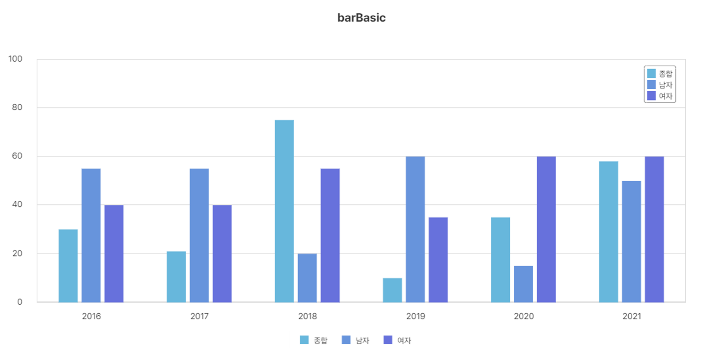

**Properties**

  <table style="border-collapse: collapse; width: 100%;">
  <thead>
    <tr>
      <th style="border: 1px solid black; padding: 10px; text-align: center; background-color: #f2f2f2;">하위 속성</th>
      <th style="border: 1px solid black; padding: 10px; text-align: center; background-color: #f2f2f2;">설명</th>
      <th style="border: 1px solid black; padding: 10px; text-align: center; background-color: #f2f2f2;">타입</th>
      <th style="border: 1px solid black; padding: 10px; text-align: center; background-color: #f2f2f2;">기본값</th>
    </tr>
  </thead>
  <tbody>
    <tr>
      <td style="border: 1px solid black; padding: 10px;">Background</td>
      <td style="border: 1px solid black; padding: 10px;">범례의 배경 색을 지정합니다.</td>
      <td style="border: 1px solid black; padding: 10px;">string</td>
      <td style="border: 1px solid black; padding: 10px;">white</td>
    </tr>
    <tr>
      <td style="border: 1px solid black; padding: 10px;">Colors</td>
      <td style="border: 1px solid black; padding: 10px;">범례의 아이콘 색을 지정합니다. 지정하지 않으면 요소의 색을 따라갑니다. 데이터셋 수만큼 지정할 수 있습니다. 데이터셋이 2개일 때의 예시가 있습니다.</td>
      <td style="border: 1px solid black; padding: 10px;">object</td>
      <td style="border: 1px solid black; padding: 10px;">null</td>
    </tr>
    <tr>
      <td style="border: 1px solid black; padding: 10px;">ColorShape</td>
      <td style="border: 1px solid black; padding: 10px;">범례의 아이콘 모양을 지정합니다. 기본은 square이며, circle, triangle, line 등을 사용할 수 있습니다.</td>
      <td style="border: 1px solid black; padding: 10px;">string</td>
      <td style="border: 1px solid black; padding: 10px;">square</td>
    </tr>
    <tr>
      <td style="border: 1px solid black; padding: 10px;">Data</td>
      <td style="border: 1px solid black; padding: 10px;">범례에 사용 될 라벨 데이터를 지정합니다. binddataset을 사용하기 때문에 배열 안에 해당 데이터셋의 컬럼 값을 사용합니다. 또는 임의로 지정할 수 있습니다.</td>
      <td style="border: 1px solid black; padding: 10px;">object</td>
      <td style="border: 1px solid black; padding: 10px;">null</td>
    </tr>
    <tr>
      <td style="border: 1px solid black; padding: 10px;">Halign</td>
      <td style="border: 1px solid black; padding: 10px;">범례의 세로 정렬을 지정합니다. left와 right를 사용할 수 있습니다.</td>
      <td style="border: 1px solid black; padding: 10px;">object</td>
      <td style="border: 1px solid black; padding: 10px;">null</td>
    </tr>
    <tr>
      <td style="border: 1px solid black; padding: 10px;">Interactive</td>
      <td style="border: 1px solid black; padding: 10px;">범례의 라벨을 클릭했을 때 상호작용할 지 여부입니다. 범례 라벨 클릭 시 해당 데이터 영역이 강조됩니다.</td>
      <td style="border: 1px solid black; padding: 10px;">boolean</td>
      <td style="border: 1px solid black; padding: 10px;">FALSE</td>
    </tr>
    <tr>
      <td style="border: 1px solid black; padding: 10px;">InteractiveHighlightChartFill</td>
      <td style="border: 1px solid black; padding: 10px;">범례 키에 해당하는 데이터 영역을 지정한 색으로 채웁니다.</td>
      <td style="border: 1px solid black; padding: 10px;">string</td>
      <td style="border: 1px solid black; padding: 10px;">rgba(255,255,255,0.7)</td>
    </tr>
    <tr>
      <td style="border: 1px solid black; padding: 10px;">InteractiveHighlightChartStroke</td>
      <td style="border: 1px solid black; padding: 10px;">범례 키에 해당하는 데이터 영역의 테두리를 지정한 색으로 채웁니다.</td>
      <td style="border: 1px solid black; padding: 10px;">string</td>
      <td style="border: 1px solid black; padding: 10px;">rgba(255,0,0,0.3)</td>
    </tr>
    <tr>
      <td style="border: 1px solid black; padding: 10px;">InteractiveHighlightLabel</td>
      <td style="border: 1px solid black; padding: 10px;">범례의 라벨을 강조하는 색을 지정합니다.</td>
      <td style="border: 1px solid black; padding: 10px;">string</td>
      <td style="border: 1px solid black; padding: 10px;">rgba(255,0,0,0.2)</td>
    </tr>
    <tr>
      <td style="border: 1px solid black; padding: 10px;">LabelsColor</td>
      <td style="border: 1px solid black; padding: 10px;">범례의 라벨의 색을 지정합니다.</td>
      <td style="border: 1px solid black; padding: 10px;">object</td>
      <td style="border: 1px solid black; padding: 10px;">null</td>
    </tr>
    <tr>
      <td style="border: 1px solid black; padding: 10px;">LabelsFontStyle</td>
      <td style="border: 1px solid black; padding: 10px;">범례의 라벨의 폰트 스타일을 지정합니다.</td>
      <td style="border: 1px solid black; padding: 10px;">string</td>
      <td style="border: 1px solid black; padding: 10px;">12px Tahoma</td>
    </tr>
    <tr>
      <td style="border: 1px solid black; padding: 10px;">LabelsOffsetX</td>
      <td style="border: 1px solid black; padding: 10px;">범례 라벨의 가로 오프셋을 지정합니다.</td>
      <td style="border: 1px solid black; padding: 10px;">number</td>
      <td style="border: 1px solid black; padding: 10px;">0</td>
    </tr>
    <tr>
      <td style="border: 1px solid black; padding: 10px;">LabelsOffsetY</td>
      <td style="border: 1px solid black; padding: 10px;">범례 라벨의 세로 오프셋을 지정합니다.</td>
      <td style="border: 1px solid black; padding: 10px;">number</td>
      <td style="border: 1px solid black; padding: 10px;">0</td>
    </tr>
    <tr>
      <td style="border: 1px solid black; padding: 10px;">LineWidth</td>
      <td style="border: 1px solid black; padding: 10px;">범례의 테두리 선의 두께를 지정합니다.</td>
      <td style="border: 1px solid black; padding: 10px;">number</td>
      <td style="border: 1px solid black; padding: 10px;">1</td>
    </tr>
    <tr>
      <td style="border: 1px solid black; padding: 10px;">Position</td>
      <td style="border: 1px solid black; padding: 10px;">범례의 표현 방식을 지정합니다. graph, gutter, margin을 사용할 수 있습니다.</td>
      <td style="border: 1px solid black; padding: 10px;">string</td>
      <td style="border: 1px solid black; padding: 10px;">graph</td>
    </tr>
    <tr>
      <td style="border: 1px solid black; padding: 10px;">PositionMarginBoxed</td>
      <td style="border: 1px solid black; padding: 10px;">범례의 Position이 'margin'일 때, 범례를 박스 안에 표시할 지 여부입니다.</td>
      <td style="border: 1px solid black; padding: 10px;">boolean</td>
      <td style="border: 1px solid black; padding: 10px;">FALSE</td>
    </tr>
    <tr>
      <td style="border: 1px solid black; padding: 10px;">PositionMarginHSpace</td>
      <td style="border: 1px solid black; padding: 10px;">범례의 Position이 'margin'일 때, 범례의 데이터 사이의 간격을 지정합니다.</td>
      <td style="border: 1px solid black; padding: 10px;">number</td>
      <td style="border: 1px solid black; padding: 10px;">0</td>
    </tr>
    <tr>
      <td style="border: 1px solid black; padding: 10px;">PositionX</td>
      <td style="border: 1px solid black; padding: 10px;">범례의 가로 좌표를 지정할 수 있습니다.</td>
      <td style="border: 1px solid black; padding: 10px;">object</td>
      <td style="border: 1px solid black; padding: 10px;">null</td>
    </tr>
    <tr>
      <td style="border: 1px solid black; padding: 10px;">PositionY</td>
      <td style="border: 1px solid black; padding: 10px;">범례의 세로 좌표를 지정할 수 있습니다.</td>
      <td style="border: 1px solid black; padding: 10px;">object</td>
      <td style="border: 1px solid black; padding: 10px;">null</td>
    </tr>
    <tr>
      <td style="border: 1px solid black; padding: 10px;">Rounded</td>
      <td style="border: 1px solid black; padding: 10px;">범례의 모서리를 둥글게 할 지 여부입니다. keyPosition이 margin이나 gutter에서만 동작합니다.</td>
      <td style="border: 1px solid black; padding: 10px;">boolean</td>
      <td style="border: 1px solid black; padding: 10px;">TRUE</td>
    </tr>
    <tr>
      <td style="border: 1px solid black; padding: 10px;">Shadow</td>
      <td style="border: 1px solid black; padding: 10px;">범례에 음영을 표시할 지 여부입니다.</td>
      <td style="border: 1px solid black; padding: 10px;">boolean</td>
      <td style="border: 1px solid black; padding: 10px;">FALSE</td>
    </tr>
    <tr>
      <td style="border: 1px solid black; padding: 10px;">ShadowStyle</td>
      <td style="border: 1px solid black; padding: 10px;">범례 음영의 스타일을 지정합니다. 'offsetX offsetY blur color' 로 구성되어 있습니다.</td>
      <td style="border: 1px solid black; padding: 10px;">string</td>
      <td style="border: 1px solid black; padding: 10px;">2px 2px 3px #666666</td>
    </tr>
  </tbody>
</table>

---
```javascript
// ① 범례 예제
// Basic예제와 동일합니다

options: {
    key: {
        Data: ['종합', '남자', '여자'],
        // Position을 margin으로 설정합니다.
        Position: 'margin',
        PositionMarginHSpace: 15, // 범례 안 수평 여백
        // Y축 위치 설정
        PositionY: (canvas.offsetHeight - 20) - 15
    }
}
```
```javascript
// ② 범례 예제
// Basic예제와 동일합니다

options: {
    key: {
        Data: ['종합', '남자', '여자'],
        // Position을 'graph'으로 설정합니다.
        Position: 'graph',
        // 범례의 테두리 색상을 설정합니다.
        BorderColor: "#E2E2E2"
    }
}
```

### 2.9 툴팁 설정하기
---

 

<table style="border-collapse: collapse; width: 100%; margin: auto;">
  <thead>
    <tr>
      <th style="border: 1px solid black; padding: 10px; text-align: center; background-color: #f2f2f2;">Sub property</th>
      <th style="border: 1px solid black; padding: 10px; text-align: center; background-color: #f2f2f2;">설명</th>
      <th style="border: 1px solid black; padding: 10px; text-align: center; background-color: #f2f2f2;">타입</th>
      <th style="border: 1px solid black; padding: 10px; text-align: center; background-color: #f2f2f2;">기본값</th>
    </tr>
  </thead>
  <tbody>
    <tr>
      <td style="border: 1px solid black; padding: 10px;">Css</td>
      <td style="border: 1px solid black; padding: 10px;">툴팁의 CSS를 지정합니다. 지정할 수 있는 CSS는 color, backgroundColor, fontSize, fontFamily 등이 있습니다.</td>
      <td style="border: 1px solid black; padding: 10px;">object</td>
      <td style="border: 1px solid black; padding: 10px;">null</td>
    </tr>
    <tr>
      <td style="border: 1px solid black; padding: 10px;">Data</td>
      <td style="border: 1px solid black; padding: 10px;">툴팁에 보여줄 데이터를 지정합니다. '%{key}', '%{value}', html 태그와 %prop, %property 등을 사용할 수 있습니다.</td>
      <td style="border: 1px solid black; padding: 10px;">object</td>
      <td style="border: 1px solid black; padding: 10px;">null</td>
    </tr>
    <tr>
      <td style="border: 1px solid black; padding: 10px;">Effect</td>
      <td style="border: 1px solid black; padding: 10px;">툴팁의 효과를 지정합니다. slide, fade를 사용할 수 있습니다.</td>
      <td style="border: 1px solid black; padding: 10px;">string</td>
      <td style="border: 1px solid black; padding: 10px;">slide</td>
    </tr>
    <tr>
      <td style="border: 1px solid black; padding: 10px;">Event</td>
      <td style="border: 1px solid black; padding: 10px;">툴팁을 발생시키는 이벤트를 지정합니다. onclick, onmousemove 를 사용할 수 있습니다.</td>
      <td style="border: 1px solid black; padding: 10px;">string</td>
      <td style="border: 1px solid black; padding: 10px;">onmousemove</td>
    </tr>
    <tr>
      <td style="border: 1px solid black; padding: 10px;">FormattedDecimals</td>
      <td style="border: 1px solid black; padding: 10px;">%{value_formatted}처럼 형식이 지정된 툴팁을 사용할 때 소수점 이하 자릿수를 지정합니다.</td>
      <td style="border: 1px solid black; padding: 10px;">number</td>
      <td style="border: 1px solid black; padding: 10px;">0</td>
    </tr>
    <tr>
      <td style="border: 1px solid black; padding: 10px;">FormattedKeyColors</td>
      <td style="border: 1px solid black; padding: 10px;">%{key}처럼 형식이 지정된 툴팁을 사용할 때 %{key}부분에 표시되는 색상을 지정할 수 있습니다.</td>
      <td style="border: 1px solid black; padding: 10px;">object</td>
      <td style="border: 1px solid black; padding: 10px;">null</td>
    </tr>
    <tr>
      <td style="border: 1px solid black; padding: 10px;">FormattedKeyColorsShape</td>
      <td style="border: 1px solid black; padding: 10px;">%{Key}처럼 형식이 지정된 툴팁을 사용할 때 %{key}부분에 표시되는 모양을 지정할 수 있습니다. circle, square를 사용가능합니다.</td>
      <td style="border: 1px solid black; padding: 10px;">string</td>
      <td style="border: 1px solid black; padding: 10px;">square</td>
    </tr>
    <tr>
      <td style="border: 1px solid black; padding: 10px;">FormattedKeyLabels</td>
      <td style="border: 1px solid black; padding: 10px;">%{key}처럼 형식이 지정된 툴팁을 사용할 때 %{key}부분에 표시되는 라벨을 지정합니다.</td>
      <td style="border: 1px solid black; padding: 10px;">object</td>
      <td style="border: 1px solid black; padding: 10px;">[]</td>
    </tr>
    <tr>
      <td style="border: 1px solid black; padding: 10px;">FormattedListItems</td>
      <td style="border: 1px solid black; padding: 10px;">Data에 %{list}를 사용할 때, 리스트로 표시될 아이템을 지정합니다. 2차원 배열을 사용하거나 DxChart.convertDataset을 사용할 수 있습니다.</td>
      <td style="border: 1px solid black; padding: 10px;">object</td>
      <td style="border: 1px solid black; padding: 10px;">null</td>
    </tr>
    <tr>
      <td style="border: 1px solid black; padding: 10px;">FormattedListType</td>
      <td style="border: 1px solid black; padding: 10px;">Data에 %{list}를 사용할 때, 리스트에서 표시될 아이템의 정렬을 지정합니다. ul, ol이 사용 가능합니다.</td>
      <td style="border: 1px solid black; padding: 10px;">string</td>
      <td style="border: 1px solid black; padding: 10px;">ul</td>
    </tr>
    <tr>
      <td style="border: 1px solid black; padding: 10px;">FormattedPoint</td>
      <td style="border: 1px solid black; padding: 10px;">%{value_formatted}처럼 형식이 지정된 툴팁에서 소수점 표시 방식을 지정합니다.</td>
      <td style="border: 1px solid black; padding: 10px;">string</td>
      <td style="border: 1px solid black; padding: 10px;">.</td>
    </tr>
    <tr>
      <td style="border: 1px solid black; padding: 10px;">FormattedTableData</td>
      <td style="border: 1px solid black; padding: 10px;">툴팁의 형식을 테이블의 형태로 지정합니다. 3차원 배열을 사용해야 합니다. 데이터 예시는 첫번째 데이터셋의 첫번째 데이터 툴팁입니다. 같은 방법으로 n번째 테이블 툴팁을 지정할 수 있으며, 첫 번째 데이터셋의 데이터 개수만큼 배열이 작성된 후 추가 배열부터는 첫번째 데이터셋의 두번째 데이터 툴팁으로 넘어갑니다.</td>
      <td style="border: 1px solid black; padding: 10px;">object</td>
      <td style="border: 1px solid black; padding: 10px;">null</td>
    </tr>
    <tr>
      <td style="border: 1px solid black; padding: 10px;">FormattedTableHeaders</td>
      <td style="border: 1px solid black; padding: 10px;">툴팁 테이블을 사용할 때, 테이블의 헤더를 지정할 수 있습니다.</td>
      <td style="border: 1px solid black; padding: 10px;">object</td>
      <td style="border: 1px solid black; padding: 10px;">null</td>
    </tr>
    <tr>
      <td style="border: 1px solid black; padding: 10px;">FormattedThousand</td>
      <td style="border: 1px solid black; padding: 10px;">%{value_formatted}처럼 형식이 지정된 툴팁에서 천 단위 구분 기호를 지정합니다.</td>
      <td style="border: 1px solid black; padding: 10px;">string</td>
      <td style="border: 1px solid black; padding: 10px;">,</td>
    </tr>
    <tr>
      <td style="border: 1px solid black; padding: 10px;">FormattedUnitsPost</td>
      <td style="border: 1px solid black; padding: 10px;">%{value_formatted}처럼 형식이 지정된 툴팁에서 뒤에 표시할 문자를 지정합니다.</td>
      <td style="border: 1px solid black; padding: 10px;">string</td>
      <td style="border: 1px solid black; padding: 10px;"></td>
    </tr>
    <tr>
      <td style="border: 1px solid black; padding: 10px;">FormattedUnitsPre</td>
      <td style="border: 1px solid black; padding: 10px;">%{value_formatted}처럼 형식이 지정된 툴팁에서 앞에 표시할 문자를 지정합니다.</td>
      <td style="border: 1px solid black; padding: 10px;">string</td>
      <td style="border: 1px solid black; padding: 10px;"></td>
    </tr>
    <tr>
      <td style="border: 1px solid black; padding: 10px;">Highlight</td>
      <td style="border: 1px solid black; padding: 10px;">툴팁이 표시될 때 강조 효과를 사용할 지 여부입니다.</td>
      <td style="border: 1px solid black; padding: 10px;">boolean</td>
      <td style="border: 1px solid black; padding: 10px;">TRUE</td>
    </tr>
    <tr>
      <td style="border: 1px solid black; padding: 10px;">HotspotXonly</td>
      <td style="border: 1px solid black; padding: 10px;">데이터 포인트의 Y좌표가 0인 X축에 가까이 가면 해당 데이터 포인트에 툴팁이 뜰 지 여부입니다.</td>
      <td style="border: 1px solid black; padding: 10px;">boolean</td>
      <td style="border: 1px solid black; padding: 10px;">FALSE</td>
    </tr>
  </tbody>
</table>


-----

Tooltip의 데이터를 표시하기 위해 사용하는 macro종류

<table style="border-collapse: collapse; width: 100%; margin: auto;">
  <thead>
    <tr>
      <th style="border: 1px solid black; padding: 10px; text-align: center; background-color: #f2f2f2;">macro</th>
      <th style="border: 1px solid black; padding: 10px; text-align: center; background-color: #f2f2f2;">설명</th>
    </tr>
  </thead>
  <tbody>
    <tr>
      <td style="border: 1px solid black; padding: 10px;">%{index}</td>
      <td style="border: 1px solid black; padding: 10px;">여러 개의 차트를 사용할 경우, 차트의 index<br>(0부터 시작)</td>
    </tr>
    <tr>
      <td style="border: 1px solid black; padding: 10px;">%{dataset}</td>
      <td style="border: 1px solid black; padding: 10px;">하나의 차트에서 선택/지정할 데이터의 index<br>(0부터 시작)</td>
    </tr>
    <tr>
      <td style="border: 1px solid black; padding: 10px;">%{dataset2}</td>
      <td style="border: 1px solid black; padding: 10px;">bioplar차트에서 사용<br>왼쪽/오른쪽별로 번호를 부여<br>- dataset은 왼쪽부터 0~n으로 번호 부여한 후 오른쪽은 n+1~2n으로 번호를 부여되지만, dataset2는 왼쪽부터0~n으로 번호 부여한 후 오른쪽은 다시 0~n으로 번호 부여</td>
    </tr>
    <tr>
      <td style="border: 1px solid black; padding: 10px;">%{seq}</td>
      <td style="border: 1px solid black; padding: 10px;">차트가 여러 개인 경우, 전체를 하나의 index로 처리 할 경우의 데이터index<br>(0부터 시작)</td>
    </tr>
    <tr>
      <td style="border: 1px solid black; padding: 10px;">%{sequential_index}</td>
      <td style="border: 1px solid black; padding: 10px;"></td>
    </tr>
    <tr>
      <td style="border: 1px solid black; padding: 10px;">%{property:title}</td>
      <td style="border: 1px solid black; padding: 10px;">차트의 타이틀 텍스트 (option의 title에 해당)</td>
    </tr>
    <tr>
      <td style="border: 1px solid black; padding: 10px;">%{property:xa axisLabels[%{index}]}</td>
      <td style="border: 1px solid black; padding: 10px;">선택한 X축 라벨을 표시합니다.</td>
    </tr>
    <tr>
      <td style="border: 1px solid black; padding: 10px;">%{global:contries}</td>
      <td style="border: 1px solid black; padding: 10px;">global로 정의한 데이터를 표시.<br>(nexacro에서는 사용할 수 없습니다.%{property:xxx}를 사용하여 같은 효과를 낼 수 있습니다.)</td>
    </tr>
    <tr>
      <td style="border: 1px solid black; padding: 10px;">%{global:contries[%{index}]}</td>
      <td style="border: 1px solid black; padding: 10px;"></td>
    </tr>
    <tr>
      <td style="border: 1px solid black; padding: 10px;">%{global:contries[%{dataset}]}</td>
      <td style="border: 1px solid black; padding: 10px;"></td>
    </tr>
    <tr>
      <td style="border: 1px solid black; padding: 10px;">%{value}</td>
      <td style="border: 1px solid black; padding: 10px;">선택된 데이터 값</td>
    </tr>
    <tr>
      <td style="border: 1px solid black; padding: 10px;">%{value2}</td>
      <td style="border: 1px solid black; padding: 10px;">vaue : 원래의 값 그대로를 표시합니다.(123456)</td>
    </tr>
    <tr>
      <td style="border: 1px solid black; padding: 10px;">%{value_formatted}</td>
      <td style="border: 1px solid black; padding: 10px;">value_formatted : 숫자인 경우 format(123,456 형식)을 적용하여 표시합니다.</td>
    </tr>
    <tr>
      <td style="border: 1px solid black; padding: 10px;">%{percent}</td>
      <td style="border: 1px solid black; padding: 10px;">100% 차트인 경우, 해당 값에 대한 %비율을 표시</td>
    </tr>
    <tr>
      <td style="border: 1px solid black; padding: 10px;">%{percent_formatted}</td>
      <td style="border: 1px solid black; padding: 10px;"></td>
    </tr>
    <tr>
      <td style="border: 1px solid black; padding: 10px;">%{side}</td>
      <td style="border: 1px solid black; padding: 10px;">bipolar차트인 경우 , 오른쪽/왼쪽의 데이터여부를 표시<br>side : 0(왼쪽) / 1(오른쪽)</td>
    </tr>
    <tr>
      <td style="border: 1px solid black; padding: 10px;">%{side_title}</td>
      <td style="border: 1px solid black; padding: 10px;">side_title : "left"(왼쪽) , "right"(오른쪽)</td>
    </tr>
    <tr>
      <td style="border: 1px solid black; padding: 10px;">%{start}</td>
      <td style="border: 1px solid black; padding: 10px;">Gantt차트에서 사용하는 데이터값</td>
    </tr>
    <tr>
      <td style="border: 1px solid black; padding: 10px;">%{end}</td>
      <td style="border: 1px solid black; padding: 10px;">start : Data의 start값</td>
    </tr>
    <tr>
      <td style="border: 1px solid black; padding: 10px;">%{duration}</td>
      <td style="border: 1px solid black; padding: 10px;">end : Data의 end 값</td>
    </tr>
    <tr>
      <td style="border: 1px solid black; padding: 10px;">%{complete}</td>
      <td style="border: 1px solid black; padding: 10px;">duration : Data의 duration 값</td>
    </tr>
    <tr>
      <td style="border: 1px solid black; padding: 10px;">%{label}</td>
      <td style="border: 1px solid black; padding: 10px;">complete : Data의 complete 값<br>label : data의 label값<br>사용예)<br>binddataset : this.Dataset00,<br>data: 'bind:start=start,bind:end=end,bind:complete=complete,bind:label=label,bind:linewidth=linewidth,bind:color=color,bind:bgcolor=background',<br>option : {tooltips : {Data : '%{label}<br>START: %{start}<br>END: %{end}<br>COMPLETE: %{complete}'}}</td>
    </tr>
    <tr>
      <td style="border: 1px solid black; padding: 10px;">%{table}</td>
      <td style="border: 1px solid black; padding: 10px;">HTML의 table태그의 값<br>FormattedTableData에 설정된 데이터를 표시합니다.<br>해당 형식은 nexacro인 경우는 2차원 array형태,<br>HTML인 경우 table tag의 아이디</td>
    </tr>
    <tr>
      <td style="border: 1px solid black; padding: 10px;">%{group}</td>
      <td style="border: 1px solid black; padding: 10px;">%{dataset}%{dataset2}와 동일</td>
    </tr>
    <tr>
      <td style="border: 1px solid black; padding: 10px;">%{group2}</td>
      <td style="border: 1px solid black; padding: 10px;"></td>
    </tr>
    <tr>
      <td style="border: 1px solid black; padding: 10px;">%{list}</td>
      <td style="border: 1px solid black; padding: 10px;">HTML의 list태그의 값<br>FormattedListItem에 설정된 데이터를 표시합니다.<br>해당 형식은 nexacro인 경우는 2차원 array형태,<br>HTML인 경우 list tag의 아이디<br>사용예)<br>tooltips:{Data:'<h2>Results</h2> %{list}',Effect: 'none',FormattedListType: 'ol',FormattedListItems: [ ['Barry','Larry','Harry'], ['Bill','Lil','Jill'], ['Jack','Zak','Quack'] ], Event:"onclick"}</td>
    </tr>
    <tr>
      <td style="border: 1px solid black; padding: 10px;">%{function:xxx()}</td>
      <td style="border: 1px solid black; padding: 10px;">지정한 함수를 실행하고 그 결과를 표시합니다.<br>- 함수는 반드시 리턴값이 있어야 하며, String,number값이어야 합니다.<br>- 사용할 수 있는 함수<br>- javascript 고유 함수<br>- DxChart오브젝트의 메소드 함수<br>- Nexacro의 사용자 함수</td>
    </tr>
    <tr>
      <td style="border: 1px solid black; padding: 10px;">%{custom}</td>
      <td style="border: 1px solid black; padding: 10px;">FormattedCustom에 지정된 함수를 실행합니다.<br>파라미터는 specific이며, 각 차트마다 다르게 세팅이 됩니다.<br>사용예)<br>tooltips:{Data:'%{custom}',//'%{value}',Css: {fontSize: '14pt'},FormattedCustom : function(specific) {var item = specific.object.getItem(specific.index);return {label : item.name + " Airport<br>"+ "Code:" + item.abbrev};}}</td>
    </tr>
  </tbody>
</table>


#### 툴팁 유형 1


```javascript
var bar = new DxChartBar({
  id: cvs,
  elem: canvas,
  binddataset: this.Dataset00,
  data: ["bind:total", "bind:man", "bind:woman"],
  options: {
    // 기본적인 설정은 Basic예제와 동일합니다
    tooltips: {
      Data: '%{key}', // Data 값을 "%{key}" 설정 시 범례 형태로 표시됩니다.
      FormattedUnitsPost: '명', // 뒤에 붙일 문자열을 설정합니다.
      Effect: 'fade', // Tooltips의 효과를 설정합니다.
      Pointer: true, // Tooltips의 포인터를 설정합니다.
      FormattedKeyLabels: ['종합', '남자', '여자'], // Tooltips의 key 레이블을 추가합니다.
    },
  },
}).draw();
```

#### 툴팁 유형 2


```javascript
var bar = new DxChartBar({
  id: cvs,
  elem: canvas,
  binddataset: this.Dataset00,
  data: ["bind:total", "bind:man", "bind:woman"],
  options: {
    // 기본적인 설정은 Basic예제와 동일합니다
    tooltips: {
      // Html 태그를 삽입하고 매크로를 통해 표시합니다
      // Gender는 해당 key 값, value는 해당 데이터 값입니다.
      Data: '<span style="color:#ccc">[%{property:gender[%{index}]}]:</span><b>%{value}명 </b>',
      gender: ['종합', '남자', '여자'], // 사용가 설정한 property로 tootltip 데이터를 호출합니다.
    },
  },
}).draw();
```

1.  툴팁 유형3

    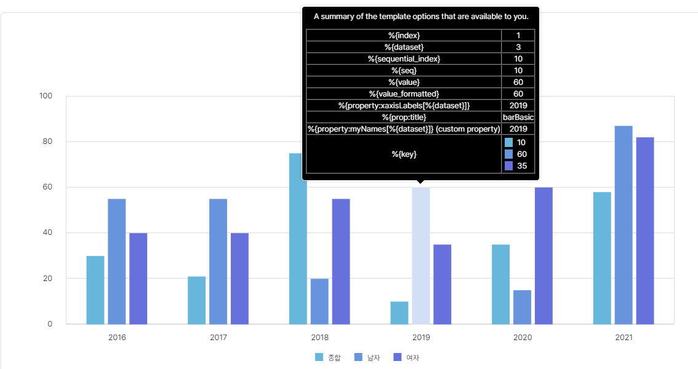

```javascript
var strHtml = "";
strHtml += 'A summary of the template options that are available to you.<p />';
strHtml += '<table border="1" align="center" cellspacing="0">';
strHtml += '<tr><td>%%{index}</td><td>%{index}</td></tr>';
strHtml += '<tr><td>%%{dataset}</td><td>%{dataset}</td></tr>';
strHtml += '<tr><td>%%{sequential_index}</td><td>%{sequential_index}</td></tr>';
strHtml += '<tr><td>%%{seq}</td><td>%{seq}</td></tr>';
strHtml += '<tr><td>%%{value}</td><td>%{value}</td></tr>';
strHtml += '<tr><td>%%{value_formatted}</td><td>%{value_formatted}</td></tr>';
strHtml += '<tr><td>%%{property:xaxisLabels[%%{dataset}]}</td>';
strHtml += '<td>%{property:xaxisLabels[%{dataset}]}</td></tr>';
strHtml += '<tr><td>%%{prop:title}</td><td>%{prop:titleText}</td></tr>';
strHtml += '<tr><td>%{property:myNames[%%{dataset}]} (custom property)</td>';
strHtml += '<td>%{property:myNames[%{dataset}]}</td></tr>';
strHtml += '<tr><td>%%{key}</td><td>%{key}</td></tr></table>';

var bar = new DxChartBar({
  id: cvs,
  elem: canvas,
  binddataset: this.Dataset00,
  data: ["bind:total", "bind:man", "bind:woman"],
  options: {
    // 기본적인 설정은 Basic예제와 동일합니다
    tooltips: {
      Data: strHtml, // tooltips의 선언한 html Data를 설정합니다.
      // 사용자가 선언한 property로도 사용가능합니다.
      myNames: DxChart.convertDataset(this.Dataset00, ["bind:indecators"]),
    },
  },
}).draw();
```


